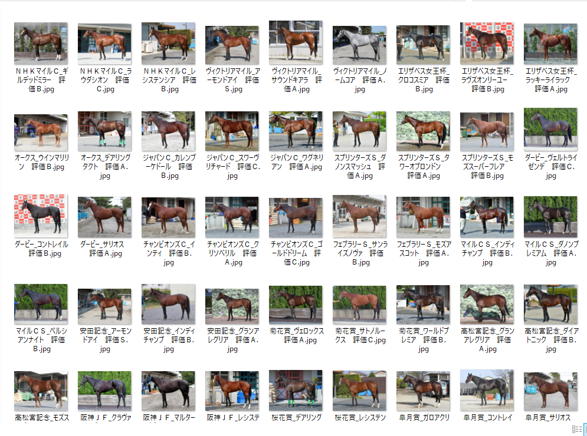

Hi. This time I would like to write an article about predicting horse racing. In the last post, I created a prediction model for horse racing rankings using table data obtained from yahoo horse racing using `LightGBM`. I used structural data last time, but anyone can do this kind of analysis in these days. So this time, I developed a `Convolutional Neural Network` (CNN) which extracts features from a horse's body image and predicts its ranking. This is the second time I've used `Earth Engine` to analyze satellite images, and the first time I've used deep learning in this blog. The code is written in Python.

## 1. Crawling for data collection

The first step is to collect images of the horse's body from the internet; the best thing to do would be to use pictures of the paddock on race day. However, as far as I've been able to find, there are no sites that post photos of the paddock in a cohesive format. It may be interesting to use it as a clipped image or to apply it as a video to the `Encoder-Decoder` model of CNN to RNN, because it may be that a horse racing fan may have a paddock video on Youtube. However, I don't have the ability to do that much.

### Where to get the data from

So in this case, the data is taken from [Daley's Web site](https://www.daily.co.jp/horse/horsecheck/photo/). Here you can find pre-race photos of horses running in the last 1 year? You can find pre-race photos of horses running in G1 races in the past year? Horse bettors who can't go to the actual racecourse can look at these pictures and analyze the condition of the horses.  
Please note that this site does not include body photos of all the horses that are entered in the race. Also, since this is only a limited number of G1 races, it's entirely possible that all the horses are finished to begin with, and it's entirely possible that you won't be able to tell the difference. However, I'll make it a priority to try and do it quickly and use this data for this one.  

### Running crawling by selenium
  
For crawling, we'll use selenium. I won't go into web crawling as I'm mainly using CNN in this article. The code I used is as follows.  
[Note] If you use the following codes, please do so at your own risk.


```python
from selenium import webdriver
from selenium.webdriver.chrome.options import Options
from selenium.webdriver.support.select import Select
from selenium.webdriver.common.by import By
from selenium.webdriver.common.keys import Keys
from selenium.webdriver.common.alert import Alert
from selenium.webdriver.support.ui import WebDriverWait
from selenium.webdriver.support import expected_conditions as EC
from selenium.common.exceptions import TimeoutException
from selenium.webdriver.common.action_chains import ActionChains
from time import sleep
from urllib import request
import random

# selenium option settings (spell)
options = Options()
options.add_argument('--disable-gpu');
options.add_argument('--disable-extensions');
options.add_argument('--proxy-server="direct://"');
options.add_argument('--proxy-bypass-list=*');
options.add_argument('--start-maximized');

# driver specification
DRIVER_PATH = r'C:/Users/aashi/Desktop/chromedriver_win32/chromedriver.exe'
driver = webdriver.Chrome(executable_path=DRIVER_PATH, chrome_options=options)

# Pass the url and go to the site
url = 'https://www.daily.co.jp/horse/horsecheck/photo/'
driver.get(url)
driver.implicitly_wait(15) # Maximum time to wait for an object to load, and if this is exceeded, an error
sleep(5) # 1 second sleep as the web page transition is performed

# Image data is saved for each race.
selector0 = "body > div > main > div > div.primaryContents > article > div > section > a"
elements = driver.find_elements_by_css_selector(selector0)
for i in range(0,len(elements)):
  elements = driver.find_elements_by_css_selector(selector0)
  element = elements[i]
  element.click()
  sleep(5) # 5 seconds sleep as the web page transition is performed

  target = driver.find_element_by_link_text('Ｇ１馬体診断写真集のTOP')
  actions = ActionChains(driver)
  actions.move_to_element(target)
  actions.perform()
  sleep(5) # 5 seconds sleep as the web page transition is performed
  selector = "body > div.wrapper.horse.is-fixedHeader.is-fixedAnimation > main > div > div.primaryContents > article > article > div.photoDetail-wrapper > section > div > figure"
  figures = driver.find_elements_by_css_selector(selector)
  download_dir = r'C:\Users\aashi\umanalytics\photo\image'
  selector = "body > div > main > div > div.primaryContents > article > article > div.photoDetail-wrapper > section > h1"
  race_name = driver.find_element_by_css_selector(selector).text
  for figure in figures:
    img_name = figure.find_element_by_tag_name('figcaption').text
    horse_src = figure.find_element_by_tag_name('img').get_attribute("src")    
    save_name = download_dir + '/' + race_name + '_' + img_name + '.jpg'
    request.urlretrieve(horse_src,save_name)
  driver.back()
```

The saved images were cross-checked with the actual race results and manually divided into the top three groups and the rest of the groups. The images are saved as follows.



This completes the collection of the original data.

## 2. Training CNN using `Keras`

### What is Keras?

Now, let's train CNN using `Keras`. `Keras` is one of the `Neural Network` libraries that runs on `Tensorflow` and `Theano`. `Keras` is one of the `Neural Network` libraries that runs on `Tensorflow` and `Theano`. `Keras` is characterized by its ability to build models with relatively short code and its many learning algorithms.

### What is CNN?

CNN is a type of `(Deep) Neural Network` often used in image analysis, and as its name suggests, it is an additional `convolution`. Convolution is a process like the following.


The input here is the image data. Image analysis recognizes and analyzes images as numerical values. The image on the computer is represented by the `RGB` value, which is a numerical value from 0 to 255 of three colors, red (Red), green (Green) and blue (Blue). There are three layers of vectors in the form of 255 red, 0 green, 0 blue, and so on, and in this case a perfect red is represented. In the case above, you can think of a, b, c, etc. as representing one of the `RGB` values of each pixel. Convolution calculates the features of an image by taking the inner product of these `RGB` values with a matrix called the kernel. The following video(Japanese) is a good example of what the convolution layer means.

<iframe width="560" height="315" src="https://www.youtube.com/embed/vU-JfZNBdYU" frameborder="0" allow="accelerometer; autoplay; encrypted-media; gyroscope; picture-in-picture" allowfullscreen></iframe>

By learning the kernel to successfully get the distinctive parts of that image, it is possible to identify the image. I think the convolutional layer is the most important part of the CNN.


As shown in the above figure, CNN has not only convolutional layers but also input and output layers as well as usual `Neural Network` layers. If you want to know about the `MaxPooling` layer, see the following movie(Japanese).

<iframe width="560" height="315" src="https://www.youtube.com/embed/MLixg9K6oeU" frameborder="0" allow="accelerometer; autoplay; encrypted-media; gyroscope; picture-in-picture" allowfullscreen></iframe>

Although the gradient method is known as the most orthodox training method for deep learning, various extension algorithms such as `Adam` have been proposed. Basically, `Adam` or `momentum` is often used.

### Coding

Now, let's get to the coding.


```python
from keras.utils import np_utils
```

```
## Using TensorFlow backend.
```

```python
from keras.models import Sequential
from keras.layers.convolutional import MaxPooling2D
from keras.layers import Activation, Conv2D, Flatten, Dense,Dropout
from sklearn.model_selection import train_test_split
from keras.optimizers import SGD, Adadelta, Adagrad, Adam, Adamax, RMSprop, Nadam
from PIL import Image
import numpy as np
import glob
import matplotlib.pyplot as plt
import time
import os
```


The first step is to convert the collected image data to numerical data to create the training data.
The directory structure is as follows, with the top image and other images being stored in separate directories. When we read in the images from each directory, we give a category variable of 1 for the top image and 0 for others.

photograph of a horse

  - superior (in rank)
  - Other


```python
#Specify a folder
folders = os.listdir(r"C:\Users\aashi\umanalytics\photo\image")
#Specify the total number of strokes (50 x 50 x 3 in this case).
image_size = 300
dense_size = len(folders)

X = []
Y = []

#Reads an image from each folder and converts it to a numpy array of RGB values using the Image function
for i, folder in enumerate(folders):
  files = glob.glob("C:/Users/aashi/umanalytics/photo/image/" + folder + "/*.jpg")
  index = i
  for k, file in enumerate(files):
    image = Image.open(file)
    image = image.convert("L").convert("RGB")
    image = image.resize((image_size, image_size)) #I'm dropping the number of pixels.
 
    data = np.asarray(image)
    X.append(data)
    Y.append(index)

X = np.array(X)
Y = np.array(Y)
X = X.astype('float32')
X = X / 255.0 # Conversion to 0~1
X.shape
Y = np_utils.to_categorical(Y, dense_size)

#splitting training data and test data
X_train, X_test, y_train, y_test = train_test_split(X, Y, test_size=0.20)
```


I've been able to split the training data and the test data. What I'm considering now is a binary classification of "top" and "other", but I defined "top" as the top 3, so the data is unbalanced (about 5 times as much other data as the top data). In this case, if we train on the data as it is, it is easier to predict the label with the larger sample size (in this case, "other"), and the model will have a bias. Therefore, it is necessary to adjust the training data so that the sample size is the same for each of the two classes.


```python
index_zero = np.random.choice(np.array(np.where(y_train[:,1]==0))[0,],np.count_nonzero(y_train[:,1]==1),replace=False)
index_one = np.array(np.where(y_train[:,1]==1))[0]
y_resampled = y_train[np.hstack((index_one,index_zero))]
X_resampled = X_train[np.hstack((index_one,index_zero))]
```

We will use this `y_resampled` and `X_resampled` for the training data. Next, we will build the CNN. In `Keras`, a model is defined by specifying a `sequential model` and adding a layer by `add` method.


```python
model = Sequential()
model.add(Conv2D(32, (3, 3), padding='same',input_shape=X_train.shape[1:]))
model.add(Activation('relu'))
model.add(Conv2D(32, (3, 3)))
model.add(Activation('relu'))
model.add(MaxPooling2D(pool_size=(2, 2)))
model.add(Dropout(0.25))

model.add(Conv2D(64, (3, 3), padding='same'))
model.add(Activation('relu'))
model.add(Conv2D(64, (3, 3)))
model.add(Activation('relu'))
model.add(MaxPooling2D(pool_size=(2, 2)))
model.add(Dropout(0.25))

model.add(Flatten())
model.add(Dense(512))
model.add(Activation('relu'))
model.add(Dropout(0.5))
model.add(Dense(dense_size))
model.add(Activation('softmax'))

model.summary()
```

```
## Model: "sequential_1"
## _________________________________________________________________
## Layer (type)                 Output Shape              Param #   
## =================================================================
## conv2d_1 (Conv2D)            (None, 300, 300, 32)      896       
## _________________________________________________________________
## activation_1 (Activation)    (None, 300, 300, 32)      0         
## _________________________________________________________________
## conv2d_2 (Conv2D)            (None, 298, 298, 32)      9248      
## _________________________________________________________________
## activation_2 (Activation)    (None, 298, 298, 32)      0         
## _________________________________________________________________
## max_pooling2d_1 (MaxPooling2 (None, 149, 149, 32)      0         
## _________________________________________________________________
## dropout_1 (Dropout)          (None, 149, 149, 32)      0         
## _________________________________________________________________
## conv2d_3 (Conv2D)            (None, 149, 149, 64)      18496     
## _________________________________________________________________
## activation_3 (Activation)    (None, 149, 149, 64)      0         
## _________________________________________________________________
## conv2d_4 (Conv2D)            (None, 147, 147, 64)      36928     
## _________________________________________________________________
## activation_4 (Activation)    (None, 147, 147, 64)      0         
## _________________________________________________________________
## max_pooling2d_2 (MaxPooling2 (None, 73, 73, 64)        0         
## _________________________________________________________________
## dropout_2 (Dropout)          (None, 73, 73, 64)        0         
## _________________________________________________________________
## flatten_1 (Flatten)          (None, 341056)            0         
## _________________________________________________________________
## dense_1 (Dense)              (None, 512)               174621184 
## _________________________________________________________________
## activation_5 (Activation)    (None, 512)               0         
## _________________________________________________________________
## dropout_3 (Dropout)          (None, 512)               0         
## _________________________________________________________________
## dense_2 (Dense)              (None, 2)                 1026      
## _________________________________________________________________
## activation_6 (Activation)    (None, 2)                 0         
## =================================================================
## Total params: 174,687,778
## Trainable params: 174,687,778
## Non-trainable params: 0
## _________________________________________________________________
```

Now, let's get to the learning part. We'll use `Adadelta` for the algorithm. I don't really understand it.


```python
optimizers ="Adadelta"
results = {}
epochs = 50
model.compile(loss='categorical_crossentropy', optimizer=optimizers, metrics=['accuracy'])
results = model.fit(X_resampled, y_resampled, validation_split=0.2, epochs=epochs)
```


### Undersampling for unbalanced data adjustment

From here, we perform binary classification with Test data, but since we are undersampling the training data, we have an undersampled sample selection bias when calculating the prediction probability. The paper is available [here](https://www3.nd.edu/~dial/publications/dalpozzolo2015calibrating.pdf).

Therefore, I would like to formulate this part of the problem here, although a correction is needed. I will describe the current binary classification problem as the problem of predicting the objective variable `\(Y\)`, which takes a binary value from the explanatory thousand `\(X\)`. Let `\((X,Y)\)` be a dataset where the positive example is considerably less than the negative example and the sample size of the negative example is matched to the positive example as `\((X_s,Y_s)\)`. We define a categorical variable `\(s\)` that takes 1 if the `\((X,Y)\)` sample set is also included in `\((X_s,Y_s)\)` and 0 if it is not.
Given an explanatory variable `\(x\)` to the model constructed using the dataset `\((X,Y)\)`, the positive example and the conditional probability of predicting can be expressed as `\(P(y=1|x)\)`. On the other hand, the conditional probability of predicting a positive example in a model constructed using `\((X_s,Y_s)\)` can be expressed as `\(P(y=1|x)\)` using Bayes' theorem and the categorical variable `\(s\)`.

$$
P(y=1|x,s=1) = \frac{P(s=1|y=1)P(y=1|x)}{P(s=1|y=1)P(y=1|x) + P(s=1|y=0)P(y=0|x)}
$$
It can be written as. Since `\((X_s,Y_s)\)` matches the sample size of the negative example to the positive example, `\(P(s=1,y=1)=1\)`, the above formula is rewritten as

$$
P(y=1|x,s=1) = \frac{P(y=1|x)}{P(y=1|x) + P(s=1|y=0)P(y=0|x)}
= \frac{P(y=1|x)}{P(y=1|x) + P(s=1|y=0)(1-P(y=1|x))}
$$
It is self-evident from the definition of `\((X_s,Y_s)\)` that `\(P(s=1|y=0)\neq0\)` (0 would result in unbalanced data with only positive examples). Thus, as long as `\(P(y=0,x) \neq0\)`, the probability that the undersampling model will be rejected as a positive example is positively biased against the probability that the original data set will produce. What we want to find is `\(P(y=1|x)\)` with no bias, so `\(P=P(y=1|x),P_s=P(y|x,s=1),\beta=P(s=1,y=0)\)`, then we can get

$$
P = \frac{\beta P_s}{\beta P_s-P_s+1}
$$
and can use this relationship formula to correct for bias.
Let's define what we've just identified as a function.


```python
def calibration(y_proba, beta):
    return y_proba / (y_proba + (1 - y_proba) / beta)

sampling_rate = sum(y_train[:,1]) / sum(1-y_train[:,1])
y_proba_calib = calibration(model.predict(X_test), sampling_rate)
y_pred = np_utils.to_categorical(np.argmax(y_proba_calib,axis=1), dense_size)

from sklearn.metrics import confusion_matrix, ConfusionMatrixDisplay, accuracy_score
score = accuracy_score(y_test, y_pred)
print('Test accuracy:', score)
```

```
## Test accuracy: 0.3220338983050847
```

It's not good at all. I ran the `ConfusionMatrix` and found out that it doesn't work.


```python
ConfusionMatrixDisplay(confusion_matrix(np.argmax(y_test,axis=1), np.argmax(y_pred,axis=1))).plot()
```

```
## <sklearn.metrics._plot.confusion_matrix.ConfusionMatrixDisplay object at 0x000000004A54CC88>
```

```python
plt.show()
```

}}index_files/figure-html/unnamed-chunk-13-1.png" width="672" />

```python
plt.close()
```

I did a bias correction for the imbalance data, but the model is still very predictive of negative values. This doesn't work.

## 3. Interpretation of results using Shap values

I would like to consider the `shap` value of the model we just learned and interpret the results. I'll add an explanation of the `shap` value when I have time. Simply put, the visualization captures which parts of the image the CNN captured features and predicted the horse to be at the top. We'll be analyzing this horse.


```python
plt.imshow(X_test[0])
plt.show()
```

}}index_files/figure-html/unnamed-chunk-14-3.png" width="672" />

```python
plt.close()
```


```python
import shap
background = X_train[np.random.choice(X_train.shape[0],100,replace=False)]

e = shap.GradientExplainer(model,background)

shap_values = e.shap_values(X_test[[0]])
shap.image_plot(shap_values[1],X_test[[0]])
```

}}index_files/figure-html/unnamed-chunk-15-5.png" width="576" />

It's very subtle, but it looks like you're appreciating the legs and buttocks, etc. It needs to be cropped to take out the horse's body only, since it seems to be responding to the background. I think I need to build a model for object detection. I'll think about this another time.

## 4. Finally

To be honest, it hasn't worked out at all. Is it still difficult to predict rankings from the horse's body? Does multiplying it with other variables change the results? I don't think I'm able to extract good features from the horses as it is.
Do I need to get to the point where I can get a paddock video from Youtube and analyze it with the `Encoder-Decoder` model to make it work? I'd love to do it when I'm good enough to do it (I don't know when that will be). Until then, I need to improve my PC specs. Maybe I'll use the cash handout.
