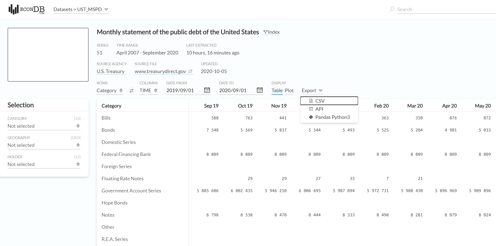

```{r,include=FALSE}
library(reticulate)
conda_path <- "C:\\Users\\aashi\\Anaconda3\\envs\\financialtech"
use_condaenv(conda_path)
```

```{r setup, include=FALSE}
knitr::opts_chunk$set(warning = FALSE)
knitr::opts_chunk$set(message = FALSE)
```

おはこんばんにちは。最近会社のPCに`Anaconda`を入れてもらいました。業務で使用することはないのですが、ワークショップで使用するので色々勉強しています。以前、Googleが提供している`Earth Engine`から衛星画像を取得して解析した際に`Python`を使用しましたが、今回は`Python`から様々なデータが取得できる`pandas_datareader`を使用したいと思います。`pandas_datareader`では以下のようなデータソースからデータが取得できます。

-   Tiingo

-   IEX

-   Alpha Vantage

-   Enigma

-   Quandl

-   St.Louis FED

-   Kenneth French's data library

-   World Bank

-   OECD

-   Eurostat

-   Thrift Saving Plan

-   Nasdaq Trader symbol definitions

-   Stooq

-   MOEX

-   Naver Finance

なお、このブログでは`Rstuio`と`blogdown`パッケージ、`git`を組み合わせて`github`上に記事を投稿しています。ですが、`Rstudio`と`reticulate`パッケージのおかげで、`python`を使用した記事も`rmd`で作成し、`html`として出力できています。ここでまず、`reticulate`パッケージを用いて`conda`仮想環境へ接続する方法を紹介しておきます。

```{r,eval=FALSE}
library(reticulate)
conda_path <- "C:\\Users\\hoge\\Anaconda3\\envs\\環境名"
use_condaenv(conda_path)
```

これで接続できます。`conda_path`には仮想環境へのパスを入力してください。

```{python}
import sys
sys.version
```

## 1. ECONDBからのデータ取得

`pandas_datareader`では、[ECOMDB](https://www.econdb.com/)からマクロ経済関連のデータを取得することができます。

### ECONDBとは？


ECONDBは各国の主要マクロ経済データをdashboard形式で提供してくれるWebサイトで、またAPIをサポートしており、PythonやExcelにシームレスにデータを連係してくれます。


### データ取得方法

`pandas_datareader`を用いた使用方法は以下の通りです。

#### 基本的な使用方法

`pandas_datareader`からデータモジュールをインポートすることから始めます。

```{python}
import pandas_datareader.data as web
```

EconDBからデータを取得するには、`DataReader`メソッドを呼び出し、以下のように`data_source`引数に`'econdb'`と適当な`query`を渡せばよいです。

```{python,eval=FALSE}
df = web.DataReader(query, data_source='econdb', **kwargs)
```

クエリパラメータの形式は、取得するデータの種類によって異なります。

#### クエリ指定方法

データはいくつかのデータセットに分割されます。データセットには、トピック、頻度、調査方法などの共通の特徴を抽出できるティッカーが付与されています。ユーザーは検索機能を使用してデータセットを探すことができます。UST\_MSPDデータセットを例にしてみます。



ページに入ると、いくつかのフィルターがあり、特定のシリーズと特定のタイムフレームに選択を絞り込むことができます。適切なフィルタが設定された状態で、`Export`ドロップダウンボタンをクリックすると、選択したデータをエクスポートするための多くのオプションとフォーマットが表示されます。その中でも、`Export to Python`は、事前にフォーマットされたパラメータを持つコードの重要な部分を表示します。これをそのまま貼り付けてしまえばデータを取得できます。


```{python}
query = "&".join([
    "dataset=UST_MSPD",
    "v=Category",
    "h=TIME",
    "from=2018-01-01",
    "to=2019-12-31"
])
df = web.DataReader(query, 'econdb')
df.head()
```

#### 実践的な取得コード

こんなこともできます。

```{python,include=FALSE}
import os
os.environ['QT_QPA_PLATFORM_PLUGIN_PATH'] = 'C:/Users/aashi/Anaconda3/envs/financialtech/Library/plugins/platforms'
```

```{python}
import pandas as pd
from matplotlib import pyplot as plt
import pandas_datareader.data as web
from datetime import datetime
import seaborn as sns

start = datetime(1980,1,1)
end = datetime(2019,12,31)

# parameters for data from econdb
country = ['US','UK','JP','EU']
indicator = ['RGDP','CPI','URATE','CA','HOU','POP','RETA','IP']

# Parse API from econdb
econ = pd.DataFrame()
for cnty in country:
    temp2 = pd.DataFrame()
    for idctr in indicator:
        temp = web.DataReader('ticker=' + idctr + cnty,'econdb',start,end)
        temp.columns = [idctr]
        temp2 = pd.concat([temp2,temp],join='outer',axis=1)
    temp2 = temp2.assign(kuni=cnty,kijyundate=temp2.index)
    econ = pd.concat([econ,temp2],join='outer')
    econ = econ.reset_index(drop=True)
econ.head()

# Plot CPI for example
sns.set
sns.relplot(data=econ,x='kijyundate',y='CPI',hue='kuni',kind='line')
plt.show()

```

## 2. World Bankからのデータ取得方法

### 世界銀行から取得できるデータとは？

世界銀行は前身が国際復興開発銀行(IBRD)、国際開発協会(IDA)であることからもわかるように開発系のデータが取得できます。最近ではCOVID-19関連のデータも取得することができます。 `pandas_datareader`では、`wb`関数を使用することで、[World Bank's World Development Indicators](https://data.worldbank.org/)と呼ばれる世界銀行の数千ものパネルデータに簡単にアクセスできます。

### データの検索方法

例えば、北米地域の国々の一人当たりの国内総生産をドルベースで比較したい場合は、`search`関数を使用します。

```{python}
from pandas_datareader import wb
matches = wb.search('gdp.*capita.*const')
print(matches.loc[:,['id','name']])
```

`NY.GDP.PCAP.KD`がそれに当たることがわかります。2010年のUSドルベースで実質化されているようです。

### データの取得方法

`download`関数でデータを取得します。

```{python}
dat = wb.download(indicator='NY.GDP.PCAP.KD', country=['US', 'CA', 'MX'], start=2010, end=2018)
print(dat)
```

`pandas`の`dataframe`形式でデータを取得できていることが分かります。年と国がindexになっていますね。

## 3. Fama/French Data Libraryからのデータ取得方法

### Fama/French Data Libraryで取れるデータとは

金融関連データになりますが、有名なFama/Frechの3 Factor modelのデータセットが[Fama/French Data Library](http://mba.tuck.dartmouth.edu/pages/faculty/ken.french/data_library.html)から取得できます。`get_available_datasets`関数は、利用可能なすべてのデータセットのリストを返します。

### データ取得方法

```{python}
from pandas_datareader.famafrench import get_available_datasets
len(get_available_datasets())
```

利用可能なデータセットは297です。 データセットにどんなものがあるか、20個ほどサンプリングしてみます。

```{python}
import random
print(random.sample(get_available_datasets(),20))
```

日本株のポートフォリオも存在します。

```{python}
ds = web.DataReader('5_Industry_Portfolios', 'famafrench')
print(ds['DESCR'])
```

5つ目がポートフォリオに含まれる銘柄数、1つ目がvalue weightedポートフォリオの月次リターンです。

```{python}
ds[4].head()
ds[0].head()
```

## 4. FERDからのデータ取得方法

### FREDで取得できるデータとは

[FRED](https://fred.stlouisfed.org/)では多種多様な経済統計データを取得することができます。サイトへ行くと、以下のように統計毎にページが存在します。この統計名の横についている`CPIAUCSL`がTickerになっており、これを渡すことで、データを取得することができます。


### データ取得方法

先ほど見たTickerを`DataReader`関数に渡し、データソースを`fred`とすることで、データを取得することができます。

```{python}
import datetime
start = datetime.datetime(2010, 1, 1)
end = datetime.datetime(2013, 1, 27)

gdp = web.DataReader('GDP', 'fred', start, end)
inflation = web.DataReader(['CPIAUCSL', 'CPILFESL'], 'fred', start, end)

gdp.head()
inflation.head()
```

## 5. OECDからのデータ取得方法

[OECD](https://stats.oecd.org/)は以前以下の記事で紹介しましたが、`pandas_datareader`でも取得することができます。

[OECD.orgからマクロパネルデータをAPIで取得する](ttps://ayatoashihara.github.io/myblog_multi/post/post22/)

ただ、`OECD dataset code`を指定するだけ[^1]なので、`pandasdmx`よりは自由度が低いです。 あと、前回取得した`MEI_ARCHIVE`とか指定するとデータが多すぎて、エラーが出ます。OECDデータを取得するときには、国や期間など細かい指定のできる`pandasdmx`のほうが良いと個人的に思います。

[^1]: サイトで統計を選び、`export >- SDMX Query`とするとその統計のコードが見れます。

なお、使用方法はFREDと同様で、データソースに`oecd`を指定します。

```{python}
df = web.DataReader('TUD', 'oecd')
df.head()
```

## 6. Eurostatからのデータ取得方法

### Eurostatから取得できるデータとは

Eurostatは欧州連合の統計局で、主にEU地域のデータを取得することができます。データは以下のように多岐にわたっており、経済金融だけでなく農業や人口動態、輸送、環境等々多種多様なデータを取得することができます。


IDをどのように取得すればよいのかですが、以下の[ページ](https://ec.europa.eu/eurostat/data/database)にて、取得したいデータを順々に掘り進めていくと黄色で色を付けたようなIDコードが出てきます。これで取得データのIDを特定します。


ただ、eurostatもOECDと同じくsdmxに対応しているため、`pandasdmx`のほうが使いやすいかもしれません。

### データ取得方法

一例として、 先ほど見た`Employment and activity by sex and age - annual data`を取得してみます。

```{python}
df = web.DataReader('lfsi_emp_a','eurostat').unstack()
df.head()
```

## 最後に

`pandas_datareader`を使用して、様々なソースから多種多様なデータを取得しました。資産運用会社などで働いている方はbloombergやEIKONからデータを取得できるため、あまり魅力的に感じないかもしれませんが、個人で分析をしている方や定期的にデータを取得したい方は非常によいパッケージだと思います。自分自身、この新しいWebサイトにリニューアルしてから、週次や月次単位で経済分析を上げようかなと思っており、これらを使用して経済の定点観測をしたいなと思っているところです。皆さんも興味あるデータを`pandas_datareader`で自動収集してみてください！