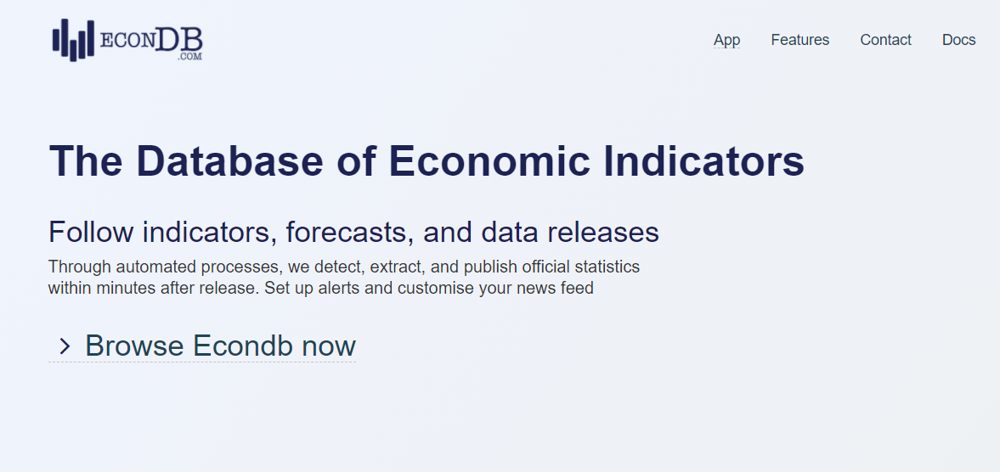
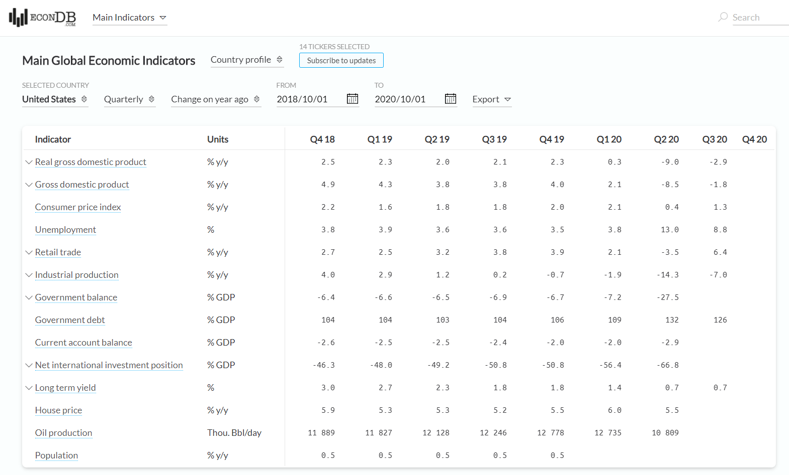
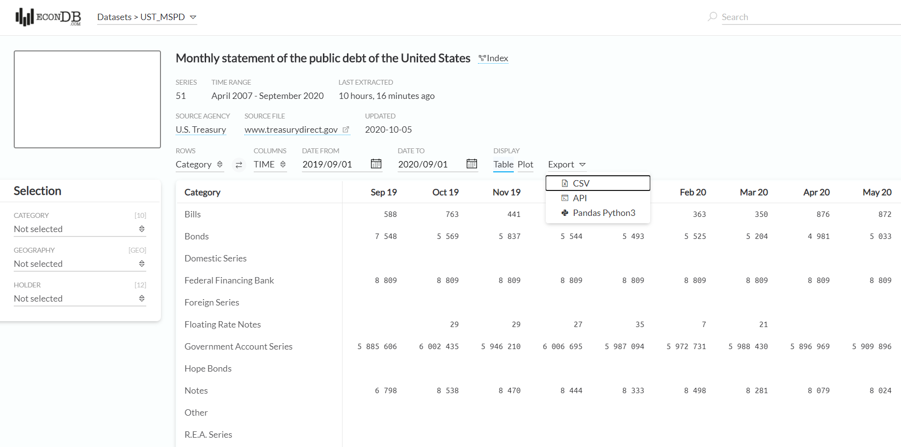
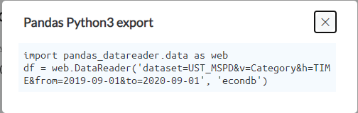
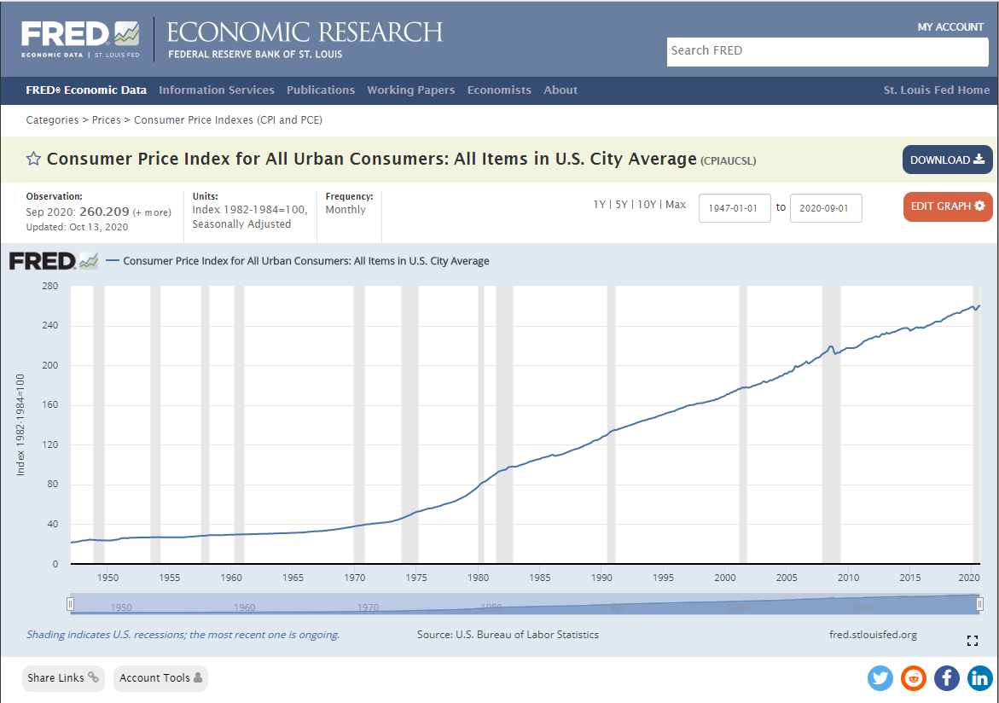
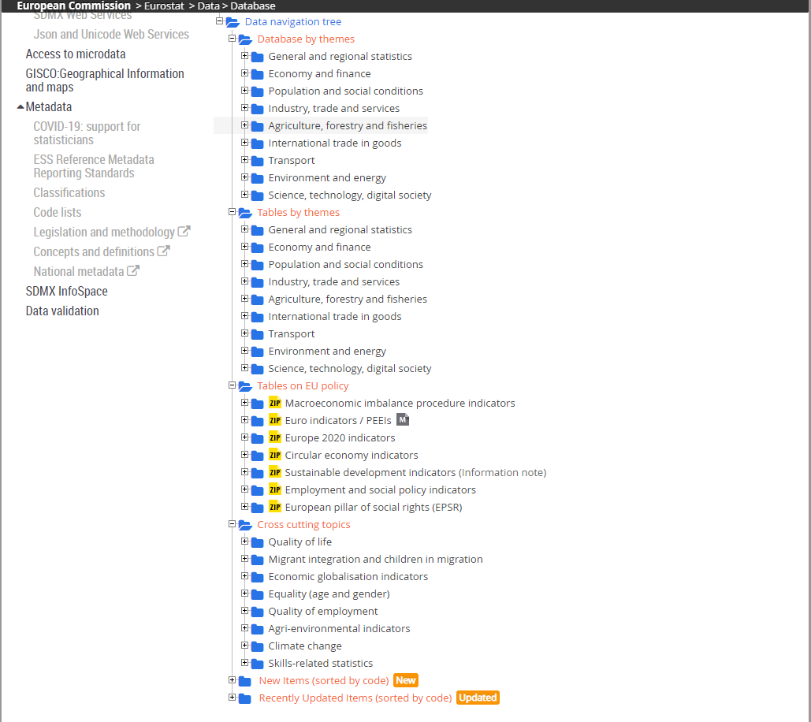
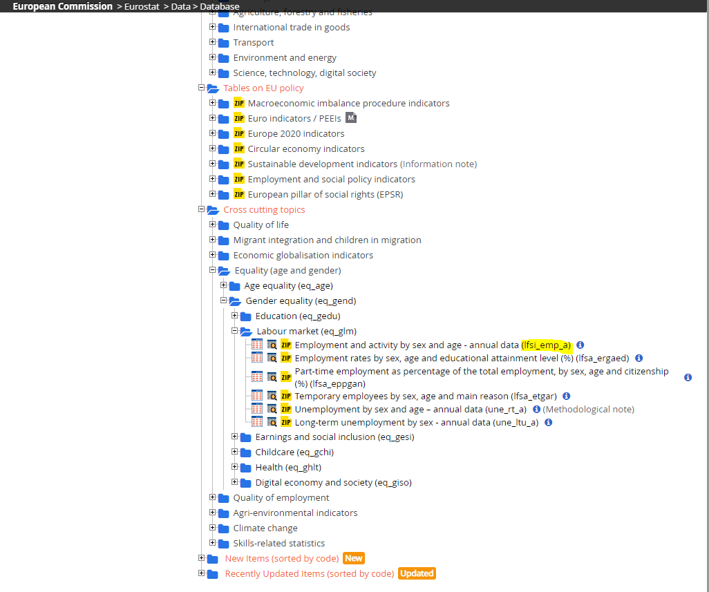

おはこんばんにちは。最近会社のPCに`Anaconda`を入れてもらいました。業務で使用することはないのですが、ワークショップで使用するので色々勉強しています。以前、Googleが提供している`Earth Engine`から衛星画像を取得して解析した際に`Python`を使用しましたが、今回は`Python`から様々なデータが取得できる`pandas_datareader`を使用したいと思います。`pandas_datareader`では以下のようなデータソースからデータが取得できます。

-   Tiingo

-   IEX

-   Alpha Vantage

-   Enigma

-   Quandl

-   St.Louis FED

-   Kenneth French's data library

-   World Bank

-   OECD

-   Eurostat

-   Thrift Saving Plan

-   Nasdaq Trader symbol definitions

-   Stooq

-   MOEX

-   Naver Finance

なお、このブログでは`Rstuio`と`blogdown`パッケージ、`git`を組み合わせて`github`上に記事を投稿しています。ですが、`Rstudio`と`reticulate`パッケージのおかげで、`python`を使用した記事も`rmd`で作成し、`html`として出力できています。ここでまず、`reticulate`パッケージを用いて`conda`仮想環境へ接続する方法を紹介しておきます。


```r
library(reticulate)
conda_path <- "C:\\Users\\hoge\\Anaconda3\\envs\\環境名"
use_condaenv(conda_path)
```

これで接続できます。`conda_path`には仮想環境へのパスを入力してください。


```python
import sys
sys.version
```

```
## '3.7.7 (default, May  6 2020, 11:45:54) [MSC v.1916 64 bit (AMD64)]'
```

## 1. ECONDBからのデータ取得

`pandas_datareader`では、[ECOMDB](https://www.econdb.com/)からマクロ経済関連のデータを取得することができます。

### ECONDBとは？



ECONDBは各国の主要マクロ経済データをdashboard形式で提供してくれるWebサイトで、またAPIをサポートしており、PythonやExcelにシームレスにデータを連係してくれます。



### データ取得方法

`pandas_datareader`を用いた使用方法は以下の通りです。

#### 基本的な使用方法

`pandas_datareader`からデータモジュールをインポートすることから始めます。


```python
import pandas_datareader.data as web
```

```
## C:\Users\aashi\Documents\R\win-library\4.1\reticulate\python\rpytools\loader.py:44: FutureWarning: pandas.util.testing is deprecated. Use the functions in the public API at pandas.testing instead.
##   level=level
```

EconDBからデータを取得するには、`DataReader`メソッドを呼び出し、以下のように`data_source`引数に`'econdb'`と適当な`query`を渡せばよいです。


```python
df = web.DataReader(query, data_source='econdb', **kwargs)
```

クエリパラメータの形式は、取得するデータの種類によって異なります。

#### クエリ指定方法

データはいくつかのデータセットに分割されます。データセットには、トピック、頻度、調査方法などの共通の特徴を抽出できるティッカーが付与されています。ユーザーは検索機能を使用してデータセットを探すことができます。UST\_MSPDデータセットを例にしてみます。



ページに入ると、いくつかのフィルターがあり、特定のシリーズと特定のタイムフレームに選択を絞り込むことができます。適切なフィルタが設定された状態で、`Export`ドロップダウンボタンをクリックすると、選択したデータをエクスポートするための多くのオプションとフォーマットが表示されます。その中でも、`Export to Python`は、事前にフォーマットされたパラメータを持つコードの重要な部分を表示します。これをそのまま貼り付けてしまえばデータを取得できます。




```python
query = "&".join([
    "dataset=UST_MSPD",
    "v=Category",
    "h=TIME",
    "from=2018-01-01",
    "to=2019-12-31"
])
df = web.DataReader(query, 'econdb')
df.head()
```

```
## Category                         Bills  ... United States Savings Securities
## Holder      Intragovernmental Holdings  ...                           Totals
## TIME_PERIOD                             ...                                 
## 2018-01-01                      3830.0  ...                           159902
## 2018-02-01                      3748.0  ...                           159475
## 2018-03-01                      4552.0  ...                           159040
## 2018-04-01                      2641.0  ...                           158606
## 2018-05-01                       577.0  ...                           158233
## 
## [5 rows x 51 columns]
```

#### 実践的な取得コード

こんなこともできます。


```python
import pandas as pd
from matplotlib import pyplot as plt
import pandas_datareader.data as web
from datetime import datetime
import seaborn as sns

start = datetime(1980,1,1)
end = datetime(2019,12,31)

# parameters for data from econdb
country = ['US','UK','JP','EU']
indicator = ['RGDP','CPI','URATE','CA','HOU','POP','RETA','IP']

# Parse API from econdb
econ = pd.DataFrame()
for cnty in country:
    temp2 = pd.DataFrame()
    for idctr in indicator:
        temp = web.DataReader('ticker=' + idctr + cnty,'econdb',start,end)
        temp.columns = [idctr]
        temp2 = pd.concat([temp2,temp],join='outer',axis=1)
    temp2 = temp2.assign(kuni=cnty,kijyundate=temp2.index)
    econ = pd.concat([econ,temp2],join='outer')
    econ = econ.reset_index(drop=True)
econ.head()

# Plot CPI for example
```

```
##         RGDP   CPI  URATE       CA  HOU       POP  RETA     IP kuni kijyundate
## 0  6842024.0  78.0    6.3 -10666.0  NaN  226554.0   NaN  52.17   US 1980-01-01
## 1        NaN  79.0    6.3      NaN  NaN  226753.0   NaN  52.20   US 1980-02-01
## 2        NaN  80.1    6.3      NaN  NaN  226955.0   NaN  51.98   US 1980-03-01
## 3  6701046.0  80.9    6.9   9844.0  NaN  227156.0   NaN  50.97   US 1980-04-01
## 4        NaN  81.7    7.5      NaN  NaN  227387.0   NaN  49.71   US 1980-05-01
```

```python
sns.set
```

```
## <function set at 0x0000000031ED0B88>
```

```python
sns.relplot(data=econ,x='kijyundate',y='CPI',hue='kuni',kind='line')
```

}}index_files/figure-html/unnamed-chunk-8-1.png" width="282" />

```python
plt.show()
```

}}index_files/figure-html/unnamed-chunk-8-2.png" width="556" />

## 2. World Bankからのデータ取得方法

### 世界銀行から取得できるデータとは？

世界銀行は前身が国際復興開発銀行(IBRD)、国際開発協会(IDA)であることからもわかるように開発系のデータが取得できます。最近ではCOVID-19関連のデータも取得することができます。 `pandas_datareader`では、`wb`関数を使用することで、[World Bank's World Development Indicators](https://data.worldbank.org/)と呼ばれる世界銀行の数千ものパネルデータに簡単にアクセスできます。

### データの検索方法

例えば、北米地域の国々の一人当たりの国内総生産をドルベースで比較したい場合は、`search`関数を使用します。


```python
from pandas_datareader import wb
matches = wb.search('gdp.*capita.*const')
print(matches.loc[:,['id','name']])
```

```
##                          id                                               name
## 716      6.0.GDPpc_constant  GDP per capita, PPP (constant 2011 internation...
## 10411        NY.GDP.PCAP.KD                 GDP per capita (constant 2015 US$)
## 10413        NY.GDP.PCAP.KN                      GDP per capita (constant LCU)
## 10415     NY.GDP.PCAP.PP.KD  GDP per capita, PPP (constant 2017 internation...
## 10416  NY.GDP.PCAP.PP.KD.87  GDP per capita, PPP (constant 1987 internation...
```

`NY.GDP.PCAP.KD`がそれに当たることがわかります。2010年のUSドルベースで実質化されているようです。

### データの取得方法

`download`関数でデータを取得します。


```python
dat = wb.download(indicator='NY.GDP.PCAP.KD', country=['US', 'CA', 'MX'], start=2010, end=2018)
print(dat)
```

```
##                     NY.GDP.PCAP.KD
## country       year                
## Canada        2018    44917.369814
##               2017    44325.416776
##               2016    43536.913403
##               2015    43596.135537
##               2014    43635.095481
##               2013    42846.284196
##               2012    42315.807389
##               2011    42036.997844
##               2010    41155.323638
## Mexico        2018     9945.776845
##               2017     9842.400712
##               2016     9751.569083
##               2015     9616.645558
##               2014     9426.324588
##               2013     9282.991933
##               2012     9280.258638
##               2011     9076.301453
##               2010     8878.561377
## United States 2018    59821.592274
##               2017    58387.775808
##               2016    57418.933846
##               2015    56863.371496
##               2014    55574.356825
##               2013    54604.130054
##               2012    53989.248340
##               2011    53190.231121
##               2010    52759.998081
```

`pandas`の`dataframe`形式でデータを取得できていることが分かります。年と国がindexになっていますね。

## 3. Fama/French Data Libraryからのデータ取得方法

### Fama/French Data Libraryで取れるデータとは

金融関連データになりますが、有名なFama/Frechの3 Factor modelのデータセットが[Fama/French Data Library](http://mba.tuck.dartmouth.edu/pages/faculty/ken.french/data_library.html)から取得できます。`get_available_datasets`関数は、利用可能なすべてのデータセットのリストを返します。

### データ取得方法


```python
from pandas_datareader.famafrench import get_available_datasets
len(get_available_datasets())
```

```
## 297
```

利用可能なデータセットは297です。 データセットにどんなものがあるか、20個ほどサンプリングしてみます。


```python
import random
print(random.sample(get_available_datasets(),20))
```

```
## ['Japan_3_Factors_Daily', 'Developed_ex_US_Mom_Factor_Daily', 'Portfolios_Formed_on_ME', '25_Portfolios_OP_INV_5x5', 'North_America_6_Portfolios_ME_OP', 'Europe_6_Portfolios_ME_Prior_250_20_daily', 'Portfolios_Formed_on_INV', '10_Industry_Portfolios_Wout_Div', '5_Industry_Portfolios', '32_Portfolios_ME_OP_INV_2x4x4', 'Europe_32_Portfolios_ME_INV(TA)_OP_2x4x4', 'North_America_6_Portfolios_ME_Prior_12_2', 'Europe_25_Portfolios_ME_Prior_12_2', 'Developed_ex_US_25_Portfolios_ME_OP_Daily', 'Europe_3_Factors', 'Portfolios_Formed_on_E-P', 'Asia_Pacific_ex_Japan_25_Portfolios_ME_Prior_12_2', 'Europe_25_Portfolios_ME_OP', 'Developed_25_Portfolios_ME_BE-ME', '38_Industry_Portfolios']
```

日本株のポートフォリオも存在します。


```python
ds = web.DataReader('5_Industry_Portfolios', 'famafrench')
print(ds['DESCR'])
```

```
## 5 Industry Portfolios
## ---------------------
## 
## This file was created by CMPT_IND_RETS using the 202201 CRSP database. It contains value- and equal-weighted returns for 5 industry portfolios. The portfolios are constructed at the end of June. The annual returns are from January to December. Missing data are indicated by -99.99 or -999. Copyright 2022 Kenneth R. French
## 
##   0 : Average Value Weighted Returns -- Monthly (59 rows x 5 cols)
##   1 : Average Equal Weighted Returns -- Monthly (59 rows x 5 cols)
##   2 : Average Value Weighted Returns -- Annual (5 rows x 5 cols)
##   3 : Average Equal Weighted Returns -- Annual (5 rows x 5 cols)
##   4 : Number of Firms in Portfolios (59 rows x 5 cols)
##   5 : Average Firm Size (59 rows x 5 cols)
##   6 : Sum of BE / Sum of ME (5 rows x 5 cols)
##   7 : Value-Weighted Average of BE/ME (5 rows x 5 cols)
```

5つ目がポートフォリオに含まれる銘柄数、1つ目がvalue weightedポートフォリオの月次リターンです。


```python
ds[4].head()
```

```
##          Cnsmr  Manuf  HiTec  Hlth   Other
## Date                                      
## 2017-03    519    592    663    577   1025
## 2017-04    517    586    658    574   1018
## 2017-05    515    583    655    572   1009
## 2017-06    511    580    651    570   1000
## 2017-07    525    615    684    613   1056
```

```python
ds[0].head()
```

```
##          Cnsmr  Manuf  HiTec  Hlth   Other
## Date                                      
## 2017-03   0.79  -0.20   1.91   0.03  -1.69
## 2017-04   1.82   0.36   2.19   0.91   0.23
## 2017-05   2.02   0.35   3.12  -0.25  -0.45
## 2017-06  -1.19   0.32  -2.12   5.54   4.22
## 2017-07  -0.07   2.31   4.02   0.70   1.49
```

## 4. FERDからのデータ取得方法

### FREDで取得できるデータとは

[FRED](https://fred.stlouisfed.org/)では多種多様な経済統計データを取得することができます。サイトへ行くと、以下のように統計毎にページが存在します。この統計名の横についている`CPIAUCSL`がTickerになっており、これを渡すことで、データを取得することができます。



### データ取得方法

先ほど見たTickerを`DataReader`関数に渡し、データソースを`fred`とすることで、データを取得することができます。


```python
import datetime
start = datetime.datetime(2010, 1, 1)
end = datetime.datetime(2013, 1, 27)

gdp = web.DataReader('GDP', 'fred', start, end)
inflation = web.DataReader(['CPIAUCSL', 'CPILFESL'], 'fred', start, end)

gdp.head()
```

```
##                   GDP
## DATE                 
## 2010-01-01  14764.611
## 2010-04-01  14980.193
## 2010-07-01  15141.605
## 2010-10-01  15309.471
## 2011-01-01  15351.444
```

```python
inflation.head()
```

```
##             CPIAUCSL  CPILFESL
## DATE                          
## 2010-01-01   217.488   220.633
## 2010-02-01   217.281   220.731
## 2010-03-01   217.353   220.783
## 2010-04-01   217.403   220.822
## 2010-05-01   217.290   220.962
```

## 5. OECDからのデータ取得方法

[OECD](https://stats.oecd.org/)は以前以下の記事で紹介しましたが、`pandas_datareader`でも取得することができます。

[OECD.orgからマクロパネルデータをAPIで取得する](ttps://ayatoashihara.github.io/myblog_multi/post/post22/)

ただ、`OECD dataset code`を指定するだけ[^1]なので、`pandasdmx`よりは自由度が低いです。 あと、前回取得した`MEI_ARCHIVE`とか指定するとデータが多すぎて、エラーが出ます。OECDデータを取得するときには、国や期間など細かい指定のできる`pandasdmx`のほうが良いと個人的に思います。

[^1]: サイトで統計を選び、`export >- SDMX Query`とするとその統計のコードが見れます。

なお、使用方法はFREDと同様で、データソースに`oecd`を指定します。


```python
df = web.DataReader('TUD', 'oecd')
df.head()
```

```
## Country                  Australia  ...                Slovenia
## Frequency                   Annual  ...                  Annual
## Measure    Percentage of employees  ... Percentage of employees
## Time                                ...                        
## 2018-01-01                     NaN  ...                     NaN
## 2019-01-01                     NaN  ...                     NaN
## 2020-01-01                     NaN  ...                     NaN
## 
## [3 rows x 39 columns]
```

## 6. Eurostatからのデータ取得方法

### Eurostatから取得できるデータとは

Eurostatは欧州連合の統計局で、主にEU地域のデータを取得することができます。データは以下のように多岐にわたっており、経済金融だけでなく農業や人口動態、輸送、環境等々多種多様なデータを取得することができます。



IDをどのように取得すればよいのかですが、以下の[ページ](https://ec.europa.eu/eurostat/data/database)にて、取得したいデータを順々に掘り進めていくと黄色で色を付けたようなIDコードが出てきます。これで取得データのIDを特定します。



ただ、eurostatもOECDと同じくsdmxに対応しているため、`pandasdmx`のほうが使いやすいかもしれません。

### データ取得方法

一例として、 先ほど見た`Employment and activity by sex and age - annual data`を取得してみます。


```python
df = web.DataReader('lfsi_emp_a','eurostat').unstack()
df.head()
```

```
## UNIT                            INDIC_EM                                                   SEX      AGE                  GEO      FREQ    TIME_PERIOD
## Percentage of total population  Persons in the labour force (former name: active persons)  Females  From 15 to 24 years  Austria  Annual  2018-01-01     54.0
##                                                                                                                                           2019-01-01     52.7
##                                                                                                                                           2020-01-01     52.7
##                                                                                                                          Belgium  Annual  2018-01-01     27.8
##                                                                                                                                           2019-01-01     29.5
## dtype: float64
```

## 最後に

`pandas_datareader`を使用して、様々なソースから多種多様なデータを取得しました。資産運用会社などで働いている方はbloombergやEIKONからデータを取得できるため、あまり魅力的に感じないかもしれませんが、個人で分析をしている方や定期的にデータを取得したい方は非常によいパッケージだと思います。自分自身、この新しいWebサイトにリニューアルしてから、週次や月次単位で経済分析を上げようかなと思っており、これらを使用して経済の定点観測をしたいなと思っているところです。皆さんも興味あるデータを`pandas_datareader`で自動収集してみてください！
