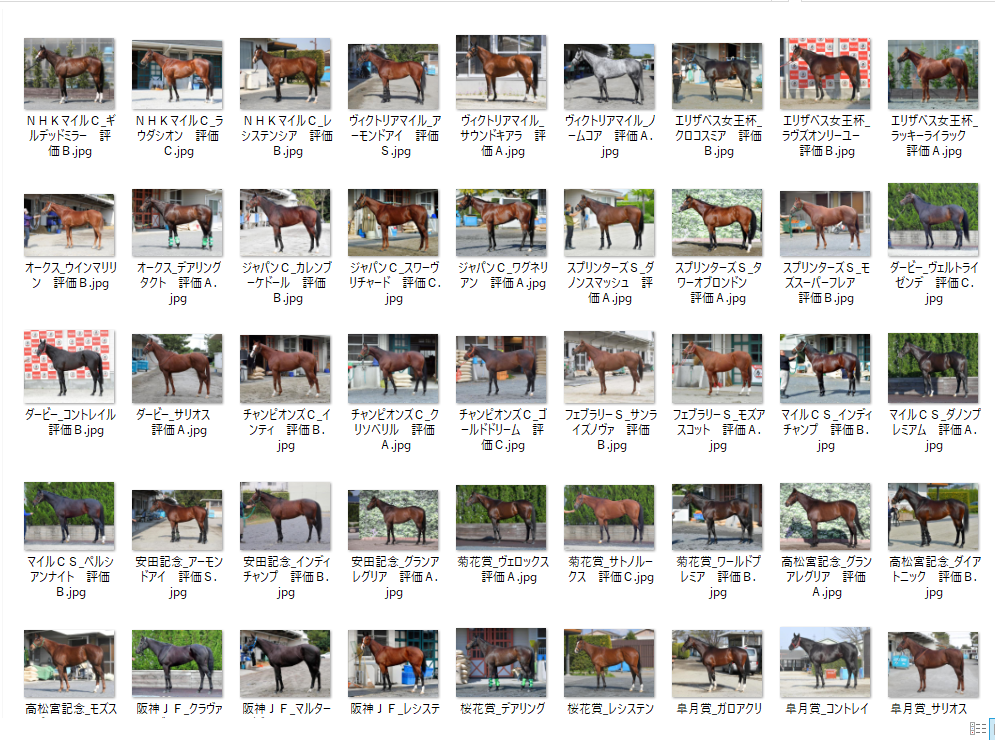

おはこんばんにちは。今回は競馬予想についての記事を書きたいと思います。前回、`LightGBM`を用いてyahoo競馬から取得したレース結果データ(テーブルデータ)を用いて、競馬順位予想モデルを作成しました。前回は構造データを用いましたが、このご時世ですからこんな分析は誰にでもできるわけです。時代は非構造データ、というわけで今回は馬体画像から特徴量を抽出し、順位予想を行う畳み込みニューラルネットワーク(`Convolutional Neural Network`, CNN)を作成してみました。画像解析は`Earth Engine`を用いた衛星画像の解析に続いて2回目、深層学習はこのブログでは初めてと言うことになります。なお、Pythonを使用しています。

## 1. データ収集のためのクローリング

まず、馬体画像をネットから収集することから始めます。1番良いのはレース当日のパドックの写真を使用することでしょう。ただ、パドックの写真をまとまった形で掲載してくれているサイトは調べた限りは存在しませんでした。もしかしたら、Youtubeに競馬ファンの方がパドック動画を上げていらっしゃるかも知れませんので、それを画像に切り抜いて使う or 動画としてCNN→RNNの`Encoder-Decoder`モデルに適用すると面白いかもしれません。しかし、そこまでの能力は今の自分にはありません。

### データをどこから取得するか

そこで、今回は[デイリーのWebサイト](https://www.daily.co.jp/horse/horsecheck/photo/)からデータを取得しています。ここには直近1年間?のG1レースに出馬する競走馬のレース前の馬体写真が掲載されています。実際のレース場へ行けない馬券師さんたちはこの写真を見て馬の状態を分析していると思われます。  
なお、このサイトには出馬全頭の馬体写真が掲載されているわけではありません。また、G1の限られたレースのみですので、そもそも全ての馬が仕上がっている可能性もあり、差がつかないことも十分予想されます。ただ、手っ取り早くやってみることを優先し、今回はこのデータを使用することにしたいと思います。  

### seleniumでクローリングを実行する
  
クローリングにはseleniumを使用します。今回はCNNがメインなのでWebクローリングについては説明しません。使用したコードは以下です。  
【注意】以下のコードを使用される場合は自己責任でお願いします。


```python
from selenium import webdriver
from selenium.webdriver.chrome.options import Options
from selenium.webdriver.support.select import Select
from selenium.webdriver.common.by import By
from selenium.webdriver.common.keys import Keys
from selenium.webdriver.common.alert import Alert
from selenium.webdriver.support.ui import WebDriverWait
from selenium.webdriver.support import expected_conditions as EC
from selenium.common.exceptions import TimeoutException
from selenium.webdriver.common.action_chains import ActionChains
from time import sleep
from urllib import request
import random

# seleniumのオプション設定（おまじない）
options = Options()
options.add_argument('--disable-gpu');
options.add_argument('--disable-extensions');
options.add_argument('--proxy-server="direct://"');
options.add_argument('--proxy-bypass-list=*');
options.add_argument('--start-maximized');

# driver指定
DRIVER_PATH = r'C:/Users/aashi/Desktop/chromedriver_win32/chromedriver.exe'
driver = webdriver.Chrome(executable_path=DRIVER_PATH, chrome_options=options)

# urlを渡し、サイトへアクセス
url = 'https://www.daily.co.jp/horse/horsecheck/photo/'
driver.get(url)
driver.implicitly_wait(15) # オブジェクトのロード待ちの最大時間でこれを越えるとエラー
sleep(5) # webページの遷移を行うので1秒sleep

# 各レース毎に画像データ保存
selector0 = "body > div > main > div > div.primaryContents > article > div > section > a"
elements = driver.find_elements_by_css_selector(selector0)
for i in range(0,len(elements)):
  elements = driver.find_elements_by_css_selector(selector0)
  element = elements[i]
  element.click()
  sleep(5) # webページの遷移を行うので5秒sleep

  target = driver.find_element_by_link_text('Ｇ１馬体診断写真集のTOP')
  actions = ActionChains(driver)
  actions.move_to_element(target)
  actions.perform()
  sleep(5) # webページの遷移を行うので5秒sleep
  selector = "body > div.wrapper.horse.is-fixedHeader.is-fixedAnimation > main > div > div.primaryContents > article > article > div.photoDetail-wrapper > section > div > figure"
  figures = driver.find_elements_by_css_selector(selector)
  download_dir = r'C:\Users\aashi\umanalytics\photo\image'
  selector = "body > div > main > div > div.primaryContents > article > article > div.photoDetail-wrapper > section > h1"
  race_name = driver.find_element_by_css_selector(selector).text
  for figure in figures:
    img_name = figure.find_element_by_tag_name('figcaption').text
    horse_src = figure.find_element_by_tag_name('img').get_attribute("src")    
    save_name = download_dir + '/' + race_name + '_' + img_name + '.jpg'
    request.urlretrieve(horse_src,save_name)
  driver.back()
```

保存した画像を実際のレース結果と突合し、手作業で上位3位以内グループとそれ以外のグループに分けました。以下のような感じで画像が保存されています。



これで元データの収集が完了しました。

## 2. `Keras`を用いてCNNを学習させる

### Kerasとは？

さて、次に`Keras`を使ってCNNを学習させましょう。まず、`Keras`とは`Tensorflow`や`Theano`上で動く`Neural Network`ライブラリの1つです。`Keras`は比較的短いコードでモデルを組むことができ、また学習アルゴリズムが多いことが特徴のようです。

### CNNとは？

CNNは画像解析を行う際によく使用される`(Deep) Neural Network`の1種で、その名の通り`Convolution`(畳み込み)を追加した物となっています。畳み込みとは以下のような処理のことを言います。


ここのインプットとは画像データのことです。画像解析では画像を数値として認識し、解析を行います。コンピュータ上の画像は`RGB`値という、赤(Red)、緑(Green)、青(Blue)の3色の0~255までの数値の強弱で表現されています。赤255、緑0、青0といった形で3層のベクトルになっており、この場合完全な赤が表現されます。上図の場合、a,b,cなどが各ピクセルの`RGB`値のいずれかを表していると考えることができます。畳み込みはこの`RGB`値をカーネルと呼ばれる行列との内積をとることで画像の特徴量を計算します。畳み込み層の意味は以下の動画がわかりやすいです。

<iframe width="560" height="315" src="https://www.youtube.com/embed/vU-JfZNBdYU" frameborder="0" allow="accelerometer; autoplay; encrypted-media; gyroscope; picture-in-picture" allowfullscreen></iframe>

カーネルを上手くその画像の特徴的な部分を取得できるように学習することで、画像の識別が可能になります。畳み込み層はCNNの最重要部分だと思います。


上図のようにCNNは畳み込み意外にももちろん入力層や出力層など通常の`Neural Network`と同じ層も持っています。なお、`MaxPooling`層について知りたい人は以下の動画を参照されてください。

<iframe width="560" height="315" src="https://www.youtube.com/embed/MLixg9K6oeU" frameborder="0" allow="accelerometer; autoplay; encrypted-media; gyroscope; picture-in-picture" allowfullscreen></iframe>

深層学習の学習方法については最急下降法(勾配法)がオーソドックスなものとして知られていますが、`Adam`など色々な拡張アルゴリズムが提案されています。基本的には、`Adam`は`momentum`を使用することが多いでしょうか。

### コーディング

では、実際にコーディングしていきます。


```python
from keras.utils import np_utils
```

```
## Using TensorFlow backend.
```

```python
from keras.models import Sequential
from keras.layers.convolutional import MaxPooling2D
from keras.layers import Activation, Conv2D, Flatten, Dense,Dropout
from sklearn.model_selection import train_test_split
from keras.optimizers import SGD, Adadelta, Adagrad, Adam, Adamax, RMSprop, Nadam
from PIL import Image
import numpy as np
import glob
import matplotlib.pyplot as plt
import time
import os
```

まず最初に収集してきた画像データを数値データに変換し学習データを作成します。
ディレクトリ構造は以下のようになっており、上位画像とその他画像が別ディレクトリに保存されています。各ディレクトリから画像を読み込む際に、上位画像には1、その他には0というカテゴリ変数を与えます。

馬体写真

  - 上位
  - その他


```python
#フォルダを指定
folders = os.listdir(r"C:\Users\aashi\umanalytics\photo\image")
#画総数を指定(今回は50×50×3)。
image_size = 300
dense_size = len(folders)

X = []
Y = []

#それぞれのフォルダから画像を読み込み、Image関数を使用してRGB値ベクトル(numpy array)へ変換
for i, folder in enumerate(folders):
  files = glob.glob("C:/Users/aashi/umanalytics/photo/image/" + folder + "/*.jpg")
  index = i
  for k, file in enumerate(files):
    image = Image.open(file)
    image = image.convert("L").convert("RGB")
    image = image.resize((image_size, image_size)) #画素数を落としている
 
    data = np.asarray(image)
    X.append(data)
    Y.append(index)

X = np.array(X)
Y = np.array(Y)
X = X.astype('float32')
X = X / 255.0 # 0~1へ変換
X.shape
Y = np_utils.to_categorical(Y, dense_size)

#訓練データとテストデータへ変換
X_train, X_test, y_train, y_test = train_test_split(X, Y, test_size=0.20)
```


訓練データとテストデータの分割ができました。今考えているのは「上位」と「その他」の2値分類となっていますが、「上位」を3位以内と定義したので不均衡なデータとなっています(その他データが上位データの5倍くらい)。こういった場合、そのままのデータで学習をするとサンプルサイズが多い方のラベル(この場合「その他」)を予測しやすくなり、バイアスのあるモデルとなります。よって、学習データは2クラスそれぞれが同じサンプルサイズとなるよう調整してやる必要があります。


```python
index_zero = np.random.choice(np.array(np.where(y_train[:,1]==0))[0,],np.count_nonzero(y_train[:,1]==1),replace=False)
index_one = np.array(np.where(y_train[:,1]==1))[0]
y_resampled = y_train[np.hstack((index_one,index_zero))]
X_resampled = X_train[np.hstack((index_one,index_zero))]
```

学習データにはこの`y_resampled`と`X_resampled`を使用します。次に、CNNを構築していきます。`Keras`では、`sequential model`を指定し、`add`メソッドで層を追加して行くことでモデルを定義します。


```python
model = Sequential()
model.add(Conv2D(32, (3, 3), padding='same',input_shape=X_train.shape[1:]))
model.add(Activation('relu'))
model.add(Conv2D(32, (3, 3)))
model.add(Activation('relu'))
model.add(MaxPooling2D(pool_size=(2, 2)))
model.add(Dropout(0.25))

model.add(Conv2D(64, (3, 3), padding='same'))
model.add(Activation('relu'))
model.add(Conv2D(64, (3, 3)))
model.add(Activation('relu'))
model.add(MaxPooling2D(pool_size=(2, 2)))
model.add(Dropout(0.25))

model.add(Flatten())
model.add(Dense(512))
model.add(Activation('relu'))
model.add(Dropout(0.5))
model.add(Dense(dense_size))
model.add(Activation('softmax'))

model.summary()
```

```
## Model: "sequential_1"
## _________________________________________________________________
## Layer (type)                 Output Shape              Param #   
## =================================================================
## conv2d_1 (Conv2D)            (None, 300, 300, 32)      896       
## _________________________________________________________________
## activation_1 (Activation)    (None, 300, 300, 32)      0         
## _________________________________________________________________
## conv2d_2 (Conv2D)            (None, 298, 298, 32)      9248      
## _________________________________________________________________
## activation_2 (Activation)    (None, 298, 298, 32)      0         
## _________________________________________________________________
## max_pooling2d_1 (MaxPooling2 (None, 149, 149, 32)      0         
## _________________________________________________________________
## dropout_1 (Dropout)          (None, 149, 149, 32)      0         
## _________________________________________________________________
## conv2d_3 (Conv2D)            (None, 149, 149, 64)      18496     
## _________________________________________________________________
## activation_3 (Activation)    (None, 149, 149, 64)      0         
## _________________________________________________________________
## conv2d_4 (Conv2D)            (None, 147, 147, 64)      36928     
## _________________________________________________________________
## activation_4 (Activation)    (None, 147, 147, 64)      0         
## _________________________________________________________________
## max_pooling2d_2 (MaxPooling2 (None, 73, 73, 64)        0         
## _________________________________________________________________
## dropout_2 (Dropout)          (None, 73, 73, 64)        0         
## _________________________________________________________________
## flatten_1 (Flatten)          (None, 341056)            0         
## _________________________________________________________________
## dense_1 (Dense)              (None, 512)               174621184 
## _________________________________________________________________
## activation_5 (Activation)    (None, 512)               0         
## _________________________________________________________________
## dropout_3 (Dropout)          (None, 512)               0         
## _________________________________________________________________
## dense_2 (Dense)              (None, 2)                 1026      
## _________________________________________________________________
## activation_6 (Activation)    (None, 2)                 0         
## =================================================================
## Total params: 174,687,778
## Trainable params: 174,687,778
## Non-trainable params: 0
## _________________________________________________________________
```

では、学習パートに入ります。アルゴリズムには`Adadelta`を使用します。よくわかってないんですけどね。。。


```python
optimizers ="Adadelta"
results = {}
epochs = 50
model.compile(loss='categorical_crossentropy', optimizer=optimizers, metrics=['accuracy'])
results = model.fit(X_resampled, y_resampled, validation_split=0.2, epochs=epochs)
```


### 不均衡データ調整のためのアンダーサンプリング

ここから、Testデータで2値分類を行うのですが、学習データをアンダーサンプリングしているので、予測確率を計算する際にアンダーサンプリングを行ったサンプル選択バイアスが生じてしまいます。論文は[こちら](https://www3.nd.edu/~dial/publications/dalpozzolo2015calibrating.pdf)。
よって、補正が必要になるのですがこの部分の定式化をここでしておきたいと思います。現在行っている2値分類問題を説明千数$X$から2値を取る目的変数$Y$を予測する問題と表現することにします。データセット$(X,Y)$は正例が負例よりもかなり少なく、負例のサンプルサイズを正例に合わせたデータセットを$(X_s,Y_s)$とします。ここで、$(X,Y)$のサンプル組が$(X_s,Y_s)$にも含まれる場合に1を取り、含まれない場合に0をとるカテゴリ変数$s$を定義します。
データセット$(X,Y)$を用いて構築したモデルに説明変数$x$を与えた時、正例と予測する条件付き確率は$P(y=1|x)$で表すことができます。一方、$(X_s,Y_s)$を用いて構築したモデルで正例を予測する条件付き確率はベイズの定理とカテゴリ変数$s$を用いて、

$$
P(y=1|x,s=1) = \frac{P(s=1|y=1)P(y=1|x)}{P(s=1|y=1)P(y=1|x) + P(s=1|y=0)P(y=0|x)}
$$
と書けます。$(X_s,Y_s)$は負例のサンプルサイズを正例に合わせているため、$P(s=1,y=1)=1$であるので上式は

$$
P(y=1|x,s=1) = \frac{P(y=1|x)}{P(y=1|x) + P(s=1|y=0)P(y=0|x)}
= \frac{P(y=1|x)}{P(y=1|x) + P(s=1|y=0)(1-P(y=1|x))}
$$
と書き換えることができます。$P(s=1|y=0)\neq0$であることは$(X_s,Y_s)$の定義より自明です(0だと正例しかない不均衡データになる)。よって、$P(y=0,x)\neq0$である限り、アンダーサンプリングのモデルが正例とはじき出す確率は元のデータセットが出す確率に対して正のバイアスがあることがわかります。求めたいのはバイアスのない$P(y=1|x)$なので$P=P(y=1|x),P_s=P(y|x,s=1),\beta=P(s=1,y=0)$とすると、

$$
P = \frac{\beta P_s}{\beta P_s-P_s+1}
$$
とかけ、この関係式を用いてバイアスを補正することができます。
今確認したことを関数として定義しましょう。


```python
def calibration(y_proba, beta):
    return y_proba / (y_proba + (1 - y_proba) / beta)

sampling_rate = sum(y_train[:,1]) / sum(1-y_train[:,1])
y_proba_calib = calibration(model.predict(X_test), sampling_rate)
y_pred = np_utils.to_categorical(np.argmax(y_proba_calib,axis=1), dense_size)

from sklearn.metrics import confusion_matrix, ConfusionMatrixDisplay, accuracy_score
score = accuracy_score(y_test, y_pred)
print('Test accuracy:', score)
```

```
## Test accuracy: 0.22033898305084745
```

まったく良くない結果です。`ConfusionMatrix`を出してみたところどうやらうまくいっていないことがわかりました。


```python
ConfusionMatrixDisplay(confusion_matrix(np.argmax(y_test,axis=1), np.argmax(y_pred,axis=1))).plot()
```

```
## <sklearn.metrics._plot.confusion_matrix.ConfusionMatrixDisplay object at 0x000000005474F108>
```

```python
plt.show()
```

}}index_files/figure-html/unnamed-chunk-12-1.png" width="672" />

```python
plt.close()
```

不均衡データのバイアス修正はしたんですが、それでもなお負値を予測しやすいモデルとなっています。これでは使えないですね。

## 3. Shap値を用いた結果解釈

今学習したモデルの`shap`値を考え、結果の解釈をしたいと思います。`shap`値については時間があれば、説明を追記したいと思います。簡単に言えば、CNNが画像のどの部分に特徴を捉え、馬が上位に入るかを予想したかを可視化で捉えることができます。この馬の解析をすることにします。


```python
plt.imshow(X_test[0])
plt.show()
```

}}index_files/figure-html/unnamed-chunk-13-3.png" width="672" />

```python
plt.close()
```


```python
import shap
background = X_train[np.random.choice(X_train.shape[0],100,replace=False)]

e = shap.GradientExplainer(model,background)

shap_values = e.shap_values(X_test[[0]])
shap.image_plot(shap_values[1],X_test[[0]])
```

}}index_files/figure-html/unnamed-chunk-14-5.png" width="576" />

非常に微妙ですが、足や臀部などを評価しているようにみえます。ですが、背景に反応しているようにも見えるので馬体のみ取り出すトリミングをやる必要がありますね。これは物体検知のモデルを構築する必要がありそうです。また、今度の機会に考えます。

## 4. 最後に

正直まったく上手くいっていません。やはり馬体から順位予測をするのは難しいのでしょうか。ほかの変数と掛け合わせると結果が変わったりするのでしょうか。今のままだとよい特徴量を抽出することができていないように思います。
Youtubeからパドック動画を取得して、`Encoder-Decoder`モデルで解析するところまでやらないとうまくいかないんですかね。自分の実力が十分上がれば是非やってみたいと思います(いつになることやら)。それまでには、PCのスペックを上げないといけません。定額給付金を使うかな。。。
