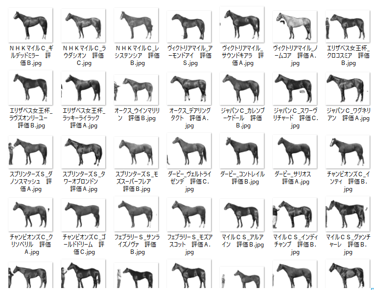

おはこんばんにちは。前回、競走馬の馬体写真からCNNを用いて順位を予想するモデルを構築しました。結果は芳しくなく、特に`shap`値を用いた要因分析を行うと馬体よりも背景の厩舎に反応している様子が見えたりと分析の精緻化が必要となりました。今回は`Pytorch`のPre-trainedモデルを用いて馬体写真から背景を切り出し、馬体のみとなった写真で再分析を行いたいと思います。

```{r,include=FALSE}
library(reticulate)
library(reticulate)
PATH <- "C:\\Users\\aashi\\Anaconda3\\python.exe"
Sys.setenv(RETICULATE_PYTHON = PATH)
py_run_string("import os as os")
py_run_string("os.environ['QT_QPA_PLATFORM_PLUGIN_PATH'] = 'C:/Users/aashi/Anaconda3/Library/plugins/platforms'")
```

```{r setup, include=FALSE}
knitr::opts_chunk$set(warning = FALSE)
knitr::opts_chunk$set(message = FALSE)
```

## 1. Pre-trainedモデルのダウンロード

コードは[こちら](https://pytorch.org/hub/pytorch_vision_deeplabv3_resnet101/)のものを参考にしています。まず、パッケージをインストールします。

```{python}
import numpy as np
import cv2
import matplotlib.pyplot as plt
import torch
import torchvision
from torchvision import transforms
import glob
from PIL import Image
import PIL
import os
```

学習済みモデルのインストールを行います。

```{python, results='hide'}
#学習済みモデルをインストール
device = torch.device("cuda:0" if torch.cuda.is_available() else "cpu")
model = torchvision.models.segmentation.deeplabv3_resnet101(pretrained=True)
model = model.to(device)
model.eval()
```

どうやら全てのPre-trainedモデルは、同じ方法で正規化された形状$（N, 3, H, W）$の3チャンネルRGB画像のミニバッチを想定しているようです。ここで$N$は画像の数、$H$と$W$は少なくとも224ピクセルであることが想定されています。画像は、[0, 1]の範囲にスケーリングされ、その後、平均値＝[0.485, 0.456, 0.406]と標準値＝[0.229, 0.224, 0.225]を使用して正規化される必要があります。ということで、前処理を行う関数を定義します。

```{python}
#前処理
preprocess = transforms.Compose([
    transforms.ToTensor(),
    transforms.Normalize(mean=[0.485, 0.456, 0.406], std=[0.229, 0.224, 0.225]),
])
```

## 2. 背景削除処理の実行

では、前回記事の`selenium`を用いたコードで収集した画像を読み込み、1枚1枚背景削除処理を行っていきます。

```{python, eval=FALSE}
#フォルダを指定
folders = os.listdir(r"C:\Users\aashi\umanalytics\photo\image")

#それぞれのフォルダから画像を読み込み、Image関数を使用してRGB値ベクトル(numpy array)へ変換
for i, folder in enumerate(folders):
  files = glob.glob("C:/Users/aashi/umanalytics/photo/image/" + folder + "/*.jpg")
  index = i
  for k, file in enumerate(files):
    img_array = np.fromfile(file, dtype=np.uint8)
    img = cv2.imdecode(img_array, cv2.IMREAD_COLOR)
    h,w,_ = img.shape
    input_tensor = preprocess(img)
    input_batch = input_tensor.unsqueeze(0).to(device)

    with torch.no_grad():
      output = model(input_batch)['out'][0]
    output_predictions = output.argmax(0)
    mask_array = output_predictions.byte().cpu().numpy()
    Image.fromarray(mask_array*255).save(r'C:\Users\aashi\umanalytics\photo\image\mask.jpg')
    mask = cv2.imread(r'C:\Users\aashi\umanalytics\photo\image\mask.jpg')
    bg = np.full_like(img,255)
    img = cv2.multiply(img.astype(float), mask.astype(float)/255)
    bg = cv2.multiply(bg.astype(float), 1.0 - mask.astype(float)/255)
    outImage = cv2.add(img, bg)
    Image.fromarray(outImage.astype(np.uint8)).convert('L').save(file)
```

行っている処理はPre-trainedモデルで以下のような`mask`画像を出力し、実際の画像の`numpy`配列と`mask`画像を統合して、背景削除画像を生成しています。出力例は以下のような感じです。

```{python,include=FALSE}
img = Image.open(r'C:\Users\aashi\Documents\myblog_multi\content\ja\post\post20\ＮＨＫマイルＣ_レシステンシア　評価Ｂ.jpg')
mask = Image.open(r'C:\Users\aashi\Documents\myblog_multi\content\ja\post\post20\mask.jpg')
outImage = Image.open(r'C:\Users\aashi\Documents\myblog_multi\content\ja\post\post20\ＮＨＫマイルＣ_レシステンシア　評価Ｂ削除.jpg')
```
```{python}
plt.gray()
plt.figure(figsize=(20,20))
plt.subplot(1,3,1)
plt.imshow(img)
plt.subplot(1,3,2)
plt.imshow(mask)
plt.subplot(1,3,3)
plt.imshow(outImage)
plt.show()
plt.close()
```
フォルダはこんな感じです。うまく処理できているものもあれば調教師の方が映ってしまっているのもありますね。物体を識別して、馬だけを`mask`する方法もあるとは思いますがこのモデルでは物体のラベリングまではできないのでこのまま進みます。



## 3. CNNを用いた分析

ここからは前回記事と同じ内容です。結果のみ掲載します。

```{python,include=FALSE}
from keras.utils import np_utils
from keras.models import Sequential
from keras.layers.convolutional import MaxPooling2D
from keras.layers import Activation, Conv2D, Flatten, Dense,Dropout
from sklearn.model_selection import train_test_split
from keras.optimizers import SGD, Adadelta, Adagrad, Adam, Adamax, RMSprop, Nadam
from PIL import Image
import numpy as np
import glob
import matplotlib.pyplot as plt
import time
import os

#フォルダを指定
folders = os.listdir(r"C:\Users\aashi\umanalytics\photo\image")
#画総数を指定(今回は50×50×3)。
image_size = 300
dense_size = len(folders)

X = []
Y = []

#それぞれのフォルダから画像を読み込み、Image関数を使用してRGB値ベクトル(numpy array)へ変換
for i, folder in enumerate(folders):
  files = glob.glob("C:/Users/aashi/umanalytics/photo/image/" + folder + "/*.jpg")
  index = i
  for k, file in enumerate(files):
    image = Image.open(file)
    image = image.convert("L").convert("RGB")
    image = image.resize((image_size, image_size)) #画素数を落としている
 
    data = np.asarray(image)
    X.append(data)
    Y.append(index)

X = np.array(X)
Y = np.array(Y)
X = X.astype('float32')
X = X / 255.0 # 0~1へ変換
X.shape
Y = np_utils.to_categorical(Y, dense_size)

#訓練データとテストデータへ変換
X_train, X_test, y_train, y_test = train_test_split(X, Y, test_size=0.20)

#アンダーサンプリング
index_zero = np.random.choice(np.array(np.where(y_train[:,1]==1))[0,],np.count_nonzero(y_train[:,1]==0),replace=False)
index_one = np.array(np.where(y_train[:,1]==1))[0]
y_resampled = y_train[np.hstack((index_one,index_zero))]
X_resampled = X_train[np.hstack((index_one,index_zero))]

model = Sequential()
model.add(Conv2D(32, (3, 3), padding='same',input_shape=X_train.shape[1:]))
model.add(Activation('relu'))
model.add(Conv2D(32, (3, 3)))
model.add(Activation('relu'))
model.add(MaxPooling2D(pool_size=(2, 2)))
model.add(Dropout(0.25))

model.add(Conv2D(64, (3, 3), padding='same'))
model.add(Activation('relu'))
model.add(Conv2D(64, (3, 3)))
model.add(Activation('relu'))
model.add(Dropout(0.25))

model.add(Flatten())
model.add(Dense(512))
model.add(Activation('relu'))
model.add(Dropout(0.5))
model.add(Dense(dense_size))
model.add(Activation('softmax'))

optimizers ="Adadelta"
results = {}
epochs = 100
model.compile(loss='categorical_crossentropy', optimizer=optimizers, metrics=['accuracy'])
#model.load_weights(r"C:\Users\aashi\umanalytics\horse_photo_weights2.h5")

def calibration(y_proba, beta):
    return y_proba / (y_proba + (1 - y_proba) / beta)

sampling_rate = sum(y_train[:,1]) / sum(1-y_train[:,1])
y_proba_calib = calibration(model.predict(X_test), sampling_rate)
y_pred = np_utils.to_categorical(np.argmax(y_proba_calib,axis=1), dense_size)
```

```{python, echo=FALSE}
from sklearn.metrics import confusion_matrix, ConfusionMatrixDisplay, accuracy_score
score = accuracy_score(y_test, y_pred)
print('Test accuracy:', score)

ConfusionMatrixDisplay(confusion_matrix(np.argmax(y_test,axis=1), np.argmax(y_pred,axis=1))).plot()
plt.show()
plt.close()
```

散々な結果になりました。
まったく識別できていません。馬体写真には順位を予測するような特徴量はないんでしょうか。それともG1の出走馬ではバラツキがなく、識別不可能なのでしょうか。いずれいにせよ、ちょっと厳しそうです。

## 4. Shap値を用いた結果解釈

前回同様、どのように失敗したのか`shap`値を使って検証してみましょう。この画像を例として使います。

```{python}
plt.imshow(X_test[4])
plt.show()
plt.close()
```

```{python}
import shap
background = X_resampled[np.random.choice(X_resampled.shape[0],100,replace=False)]

e = shap.GradientExplainer(model,background)

shap_values = e.shap_values(X_test[[4]])
shap.image_plot(shap_values[1],X_test[[4]])
```

前足から顔にかけてを評価しているようです。意外に臀部を評価している様子はありません。

## 5.まとめ

厩舎背景を削除し、再実行してみましたが結果変わらずでした。PyTorchを使ったり、背景削除を行ういい経験にはなりましたが結果は伴わずということで馬体写真はいったんここでストップです。
