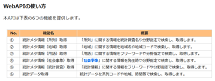
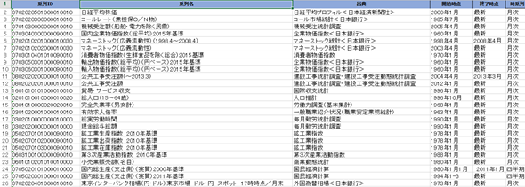

おはこんばんちわ。

最近、競馬ばっかりやってましたが、そろそろ本業のマクロの方もやらないとなということで今回は日次GDP推計に使用するデータを総務省が公開している統計ダッシュボードから取ってきました。
そもそも、前の記事では四半期GDP速報の精度が低いことをモチベーションに高頻度データを用いてより精度の高い予測値をはじき出すモデルを作れないかというテーマで研究を進めていました。しかし、先行研究を進めていくうちに、どうやら大規模な経済指標を利用することで日次で四半期GDPの予測値を計算することが可能であることが判明しました。しかも、精度も良い(米国ですが)ということで、なんとかこの方向で研究を進めていけないかということになりました。

## 1. 先行研究と具体的にやりたいこと

[先行研究](http://dept.ku.edu/~empirics/Courses/Econ844/papers/Nowcasting%20GDP.pdf)

Giannoneらが2008年にパブリッシュした論文です(JME)。彼らはアメリカの経済指標を用いて四半期GDPを日次で推計し、予測指標としての有用性を示しました。指標間の連動性(colinearity)を利用して、多数ある経済指標をいくつかのファクターに圧縮し、そのファクターを四半期GDPにフィッティングさせることによって高い予測性を実現しました。なお、ファクターの計算にはカルマンスムージングを用いています(詳しい推計方法は論文&Technical Appendixを参照)。理論的な定式化は無いのですが、なかなか当たります。そもそも私がこの研究に興味を持ったのは、以下の本を立ち読みした際に参考文献として出てきたからで、いよいよ運用機関などでも使用され始めるのかと思い、やっておこうと思った次第です。

[実践 金融データサイエンス 隠れた構造をあぶり出す6つのアプローチ](http://www.amazon.co.jp/exec/obidos/ASIN/4532134811/hatena-blog-22/)


とりあえずはGiannoneの日本版をやろうかなと思っています。実はこの後に、ファクターモデルとDSGEを組み合わせたモデルがありましてそこまで発展させたいなーなんて思っておりますが。とにかく、ファクターを計算するための経済統計が必要ですので、今回はそれを集めてきたというのがこの記事の趣旨です。

## 2. 統計ダッシュボードからのデータの収集

政府や日銀が公表しているデータの一部は統計ダッシュボードから落とすことができます。これは総務省統計局が提供しているもので、これまで利用しにくかった経済統計をより身近に使用してもらおうというのが一応のコンセプトとなっています。似たものに総務省統計局が提供しているestatがありますが、日銀の公表データがなかったり、メールアドレスの登録が必要だったりと非常に使い勝手が悪いです(個人的感想)。ただ、estatにはestatapiというRパッケージがあり、データを整形するのは比較的容易であると言えます。今回、統計ダッシュボードを選択した理由はそうは言っても日銀のデータがないのはダメだろうという理由で、データの整形に関しては関数を組みました。
そもそも統計ダッシュボードは経済統計をグラフなどで見て楽しむ？ものですが、私のような研究をしたい者を対象にAPIを提供してくれています。取得できるデータは大きく分けて6つあります。



やり方は簡単で、ベースのurlと欲しい統計のIDをGET関数で渡すことによって、データを取得することができます。公式にも以下のように書かれています。

> 基本的な使い方としては、まず①「統計メタ情報（系列）取得」で取得したいデータの[系列コード]を検索し、 その後⑥「統計データ取得」で[系列コード]を検索条件に指定し、その系列の情報を取得します。
（②③④⑤は補助的な情報として独立して取得できるようにしています。データのみ必要な場合は当該機能は不要です。）
具体的な使い方は、以下の「WebAPIの詳細仕様」に記載する[ベースURL]に検索条件となる[パラメータ]を"&"で連結し、HTTPリクエスト（GET）を送信することで目的のデータを取得できます。
各パラメータは「パラメータ名=値」のように名称と値を'='で結合し、複数のパラメータを指定する場合は「パラメータ名=値&パラメータ名=値&…」のようにそれぞれのパラメータ指定を'&'で結合してください。
また、パラメータ値は必ずURLエンコード(文字コードUTF-8)してから結合してください。

今回も以下の文献を参考にデータを取ってきたいと思います。

[Rによるスクレイピング入門](https://www.amazon.co.jp/dp/486354216X)


まず、最初にこのAPIからデータを取得し、得られた結果を分析しやすいように整形する関数を定義したいと思います。


```r
library(httr)
library(estatapi)
library(dplyr)
library(XML)
library(stringr)
library(xts)
library(GGally)
library(ggplot2)
library(seasonal)
library(dlm)
library(vars)
library(MASS)

# 関数を定義
get_dashboard <- function(ID){
  base_url <- "https://dashboard.e-stat.go.jp/api/1.0/JsonStat/getData?"
  res <- GET(
    url = base_url,
    query = list(
      IndicatorCode=ID
    )
  )
  result <- content(res)
  x <- result$link$item[[1]]$value
  x <- t(do.call("data.frame",x))
  date_x <- result$link$item[[1]]$dimension$Time$category$label
  date_x <- t(do.call("data.frame",date_x))
  date_x <- str_replace_all(date_x, pattern="年", replacement="/")
  date_x <- str_replace_all(date_x, pattern="月", replacement="")
  date_x <- as.Date(gsub("([0-9]+)/([0-9]+)", "\\1/\\2/1", date_x))
  date_x <- as.Date(date_x, format = "%m/%d/%Y")
  date_x <- as.numeric(date_x)
  date_x <- as.Date(date_x, origin="1970-01-01")
  #x <- cbind(x,date_x)
  x <- data.frame(x)
  x[,1] <- as.character(x[,1])%>%as.numeric(x[,1])
  colnames(x) <- c(result$link$item[[1]]$label)
  x <- x %>% mutate("publication" = date_x)
  return(x)
}
```

まずベースのurlを定義しています。今回はデータが欲しいので⑥統計データのベースurlを使用します（
[参考](https://dashboard.e-stat.go.jp/static/api)）。次にベースurlと統計ID（IndicatorCode）を`GET`関数で渡し、結果を取得しています。統計IDについてはエクセルファイルで公開されています。得られた結果の中身（リスト形式）をresultに格納し、リストの深層にある原数値データ（value）をxに格納します。原数値データもリスト形式なので、それを`do.call`でデータフレームに変換しています。次に、データ日付を取得します。resultの中を深くたどるとTime→category→labelというデータがあり、そこに日付データが保存されているので、それをdate_xに格納し、同じようにデータフレームへ変換します。データの仕様上、日付は「yyyy年mm月」になっていますが、これだと`R`は日付データとして読み取ってくれないので、`str_replace_all`等で変換したのち、`Date`型に変換しています。列名にデータ名（result→link→item[[1]]→label）をつけ、データ日付をxに追加したら完成です。
そのほか、`data_connect`という関数も定義しています。これはデータ系列によれば、たとえば推計方法の変更などで1980年～2005年の系列と2003年～2018年までの系列の2系列があるようなデータも存在し、この2系列を接続するための関数です。これは単純に接続しているだけなので、説明は省略します。


```r
data_connect <- function(x){
  a <- min(which(x[,ncol(x)] != "NA"))
  b <- x[a,ncol(x)]/x[a,1]
  c <- x[1:a-1,1]*b
  return(c)
}
```

では、実際にデータを取得していきます。今回取得するデータは月次データとなっています。これは統計dashboardが月次以下のデータがとれないからです。なので、例えば日経平均などは月末の終値を引っ張っています。ただし、GDPは四半期データとなっています。さきほど定義したget_dashboardの使用方法は簡単で、引数に統計ダッシュボードで公開されている統計IDを入力するだけでデータが取れます。今回使用するデータを以下の表にまとめました。




```r
# データを取得
Nikkei <- get_dashboard("0702020501000010010")
callrate <- get_dashboard("0702020300000010010")
TOPIX <- get_dashboard("0702020590000090010")
kikai <- get_dashboard("0701030000000010010")
kigyo.bukka <- get_dashboard("0703040300000090010")
money.stock1 <- get_dashboard("0702010201000010030")
money.stock2 <- get_dashboard("0702010202000010030")
money.stock <- dplyr::full_join(money.stock1,money.stock2,by="publication")
c <- data_connect(money.stock)
a <- min(which(money.stock[,ncol(money.stock)] != "NA"))
money.stock[1:a-1,ncol(money.stock)] <- c
money.stock <- money.stock[,c(2,3)]
cpi <- get_dashboard("0703010401010090010")
export.price <- get_dashboard("0703050301000090010")
import.price <- get_dashboard("0703060301000090010")
import.price$`輸出物価指数（総平均）（円ベース）2015年基準` <- NULL
public.expenditure1 <- get_dashboard("0802020200000010010")
public.expenditure2 <- get_dashboard("0802020201000010010")
public.expenditure <- dplyr::full_join(public.expenditure1,public.expenditure2,by="publication")
c <- data_connect(public.expenditure)
a <- min(which(public.expenditure[,ncol(public.expenditure)] != "NA"))
public.expenditure[1:a-1,ncol(public.expenditure)] <- c
public.expenditure <- public.expenditure[,c(2,3)]
export.service <- get_dashboard("1601010101000010010")
working.population <- get_dashboard("0201010010000010020")
yukoukyuujinn <- get_dashboard("0301020001000010010")
hours_worked <- get_dashboard("0302010000000010000")
nominal.wage <- get_dashboard("0302020000000010000") 
iip <- get_dashboard("0502070101000090010")
shukka.shisu <- get_dashboard("0502070102000090010")
zaiko.shisu <- get_dashboard("0502070103000090010")
sanji.sangyo <- get_dashboard("0603100100000090010")
retail.sells <- get_dashboard("0601010201010010000")
GDP1 <- get_dashboard("0705020101000010000")
GDP2 <- get_dashboard("0705020301000010000")
GDP <- dplyr::full_join(GDP1,GDP2,by="publication")
c <- data_connect(GDP)
a <- min(which(GDP[,ncol(GDP)] != "NA"))
GDP[1:a-1,ncol(GDP)] <- c
GDP <- GDP[,c(2,3)]
yen <- get_dashboard("0702020401000010010")
household.consumption <- get_dashboard("0704010101000010001")
JGB10y <- get_dashboard("0702020300000010020")
```

今取得したデータは原数値系列のデータが多いので、それらは季節調整をかけます。なぜ季節調整済みのデータを取得しないのかというとそれらのデータは何故か極端にサンプル期間が短くなってしまうからです。ここらへんは使い勝手が悪いです。


```r
# 季節調整をかける
Sys.setenv(X13_PATH = "C:\\Program Files\\WinX13\\x13as")
checkX13()
seasoning <- function(data,i,start.y,start.m){
  timeseries <- ts(data[,i],frequency = 12,start=c(start.y,start.m))
  m <- seas(timeseries)
  summary(m$data)
  return(m$series$s11)
}
k <- seasoning(kikai,1,2005,4)
kikai$`機械受注額（船舶・電力を除く民需）` <- as.numeric(k)
k <- seasoning(kigyo.bukka,1,1960,1)
kigyo.bukka$`国内企業物価指数（総平均）2015年基準` <- as.numeric(k)
k <- seasoning(cpi,1,1970,1)
cpi$`消費者物価指数（生鮮食品を除く総合）2015年基準` <- as.numeric(k)
k <- seasoning(export.price,1,1960,1)
export.price$`輸出物価指数（総平均）（円ベース）2015年基準` <- as.numeric(k)
k <- seasoning(import.price,1,1960,1)
import.price$`輸入物価指数（総平均）（円ベース）2015年基準` <- as.numeric(k)
k <- seasoning(public.expenditure,2,2004,4)
public.expenditure$公共工事受注額 <- as.numeric(k)
k <- seasoning(export.service,1,1996,1)
export.service$`貿易・サービス収支` <- as.numeric(k)
k <- seasoning(yukoukyuujinn,1,1963,1)
yukoukyuujinn$有効求人倍率 <- as.numeric(k)
k <- seasoning(hours_worked,1,1990,1)
hours_worked$総実労働時間 <- as.numeric(k)
k <- seasoning(nominal.wage,1,1990,1)
nominal.wage$現金給与総額 <- as.numeric(k)
k <- seasoning(iip,1,1978,1)
iip$`鉱工業生産指数　2010年基準` <- as.numeric(k)
k <- seasoning(shukka.shisu,1,1990,1)
shukka.shisu$`鉱工業出荷指数　2010年基準` <- as.numeric(k)
k <- seasoning(zaiko.shisu,1,1990,1)
zaiko.shisu$`鉱工業在庫指数　2010年基準` <- as.numeric(k)
k <- seasoning(sanji.sangyo,1,1988,1)
sanji.sangyo$`第３次産業活動指数　2010年基準` <- as.numeric(k)
k <- seasoning(retail.sells,1,1980,1)
retail.sells$`小売業販売額（名目）` <- as.numeric(k)
k <- seasoning(household.consumption,1,2010,1)
household.consumption$`二人以上の世帯　消費支出（除く住居等）` <- as.numeric(k)
GDP.ts <- ts(GDP[,2],frequency = 4,start=c(1980,1))
m <- seas(GDP.ts)
GDP$`国内総生産（支出側）（実質）2011年基準` <- m$series$s11
```

ここでは詳しく季節調整のかけ方は説明しません。x13arimaを使用しています。上述のコードを回す際はx13arimaがインストールされている必要があります。以下の記事を参考にしてください。

[http://sinhrks.hatenablog.com/entry/2014/11/09/003632]

では、データ日付を基準に落としてきたデータを結合し、データセットを作成します。


```r
# データセットに結合
dataset <- dplyr::full_join(kigyo.bukka,callrate,by="publication")
dataset <- dplyr::full_join(dataset,kikai,by="publication")
dataset <- dplyr::full_join(dataset,Nikkei,by="publication")
dataset <- dplyr::full_join(dataset,money.stock,by="publication")
dataset <- dplyr::full_join(dataset,cpi,by="publication")
dataset <- dplyr::full_join(dataset,export.price,by="publication")
dataset <- dplyr::full_join(dataset,import.price,by="publication")
dataset <- dplyr::full_join(dataset,public.expenditure,by="publication")
dataset <- dplyr::full_join(dataset,export.service,by="publication")
dataset <- dplyr::full_join(dataset,working.population,by="publication")
dataset <- dplyr::full_join(dataset,yukoukyuujinn,by="publication")
dataset <- dplyr::full_join(dataset,hours_worked,by="publication")
dataset <- dplyr::full_join(dataset,nominal.wage,by="publication")
dataset <- dplyr::full_join(dataset,iip,by="publication")
dataset <- dplyr::full_join(dataset,shukka.shisu,by="publication")
dataset <- dplyr::full_join(dataset,zaiko.shisu,by="publication")
dataset <- dplyr::full_join(dataset,sanji.sangyo,by="publication")
dataset <- dplyr::full_join(dataset,retail.sells,by="publication")
dataset <- dplyr::full_join(dataset,yen,by="publication")
colnames(dataset) <- c("DCGPI","publication","callrate","Machinery_Orders",
                       "Nikkei225","money_stock","CPI","export_price",
                       "import_price","public_works_order",
                       "trade_service","working_population",
                       "active_opening_ratio","hours_worked",
                       "wage","iip_production","iip_shipment","iip_inventory",
                       "ITIA","retail_sales","yen")
```

最後に列名をつけています。datasetはそれぞれのデータの公表開始時期が異なるために大量の`NA`を含むデータフレームとなっているので、`NA`を削除するために最もデータの開始時期が遅い機械受注統計に合わせてデータセットを再構築します。


```r
a <- min(which(dataset$Machinery_Orders != "NA"))
dataset1 <- dataset[a:nrow(dataset),]
dataset1 <- na.omit(dataset1)
rownames(dataset1) <- dataset1$publication
dataset1 <- dataset1[,-2]
dataset1.xts <- xts(dataset1,order.by = as.Date(rownames(dataset1)))
```

これでとりあえずデータの収集は終わりました。

## 3. 得られたデータを主成分分析にかけてみる

本格的な分析はまた今後にしたいのですが、データを集めるだけでは面白くないので、Gianonneらのように主成分分析を行いたいと思います。主成分分析をこれまでに学んだことのない方は以下を参考にしてください。個人的にはわかりやすいと思っています。

[主成分分析(Principal Component Analysis, PCA)～データセットの見える化・可視化といったらまずはこれ！～](https://datachemeng.com/principalcomponentanalysis/)

では主成分分析を実行してみます。`R`では`prcomp`関数を使用することで非常に簡単に主成分分析を行うことができます。


```r
# 主成分分析を実行
factor.pca <- prcomp(x=dataset1, cor = TRUE) # cor = TRUEでデータの基準化を自動で行ってくれる。
summary(factor.pca)
```

```
## Importance of components:
##                              PC1       PC2       PC3       PC4       PC5  PC6
## Standard deviation     1.855e+06 4.268e+05 1.777e+05 1.204e+05 3.967e+04 3733
## Proportion of Variance 9.374e-01 4.963e-02 8.610e-03 3.950e-03 4.300e-04    0
## Cumulative Proportion  9.374e-01 9.870e-01 9.956e-01 9.996e-01 1.000e+00    1
##                         PC7  PC8   PC9  PC10 PC11  PC12  PC13   PC14   PC15
## Standard deviation     1347 1063 134.4 4.338 3.66 2.088 1.757 0.8261 0.7207
## Proportion of Variance    0    0   0.0 0.000 0.00 0.000 0.000 0.0000 0.0000
## Cumulative Proportion     1    1   1.0 1.000 1.00 1.000 1.000 1.0000 1.0000
##                          PC16   PC17   PC18   PC19    PC20    PC21
## Standard deviation     0.5309 0.3752 0.2632 0.1085 0.01238 0.01038
## Proportion of Variance 0.0000 0.0000 0.0000 0.0000 0.00000 0.00000
## Cumulative Proportion  1.0000 1.0000 1.0000 1.0000 1.00000 1.00000
```

```r
screeplot(factor.pca)
```

}}index_files/figure-html/unnamed-chunk-7-1.png" width="672" />

```r
pc.xts <- xts(factor.pca$x[,1:3], order.by = as.Date(rownames(dataset1)))
plot.zoo(pc.xts,col=c("red","blue","green","purple","yellow"),plot.type = "single") # 主成分を時系列プロット
```

}}index_files/figure-html/unnamed-chunk-7-2.png" width="672" />

第3主成分まででデータの約80％が説明できる結果を得たので、第3主成分までのプロットをお見せします。第1主成分（赤）はトレンドを表しており、これから景気の趨勢を読み取れると思います。第2主成分（青）は景気循環項でしょうか。周期的な動きが読み取れます。第3主成分（緑）は2014年に大きく上昇していますが、それ以外は特に目立った動きはありません。謎ですね。とりあえず今日はこれまで。時系列データをトレンド項、循環項、誤差項に分解したような結果でした。次回はGianonne et. al.(2008)の日本版の再現を行いたいと思います。
